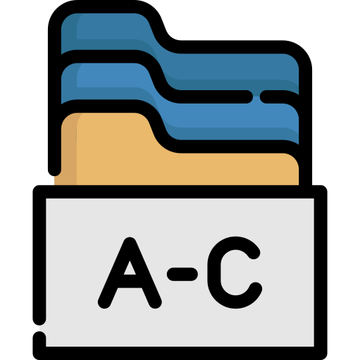

# Introduction to Front-End
## Front-End là gì?
- Front-End sẽ tập trung nhiều thời gian dành ra để xây dựng, thiết kế giao diện sao cho dễ sử dụng, tiện tích và phù hợp nhất.Ngoài ra các developer còn phải để ý đến những trải nghiệm người dùng ở trên nhiều loại thiết bị khác nhau,...

- Việc bố cục các thành phần của một trang web được gọi là việc xây dựng UI (User Interface). Thông thường, việc bố cục các thành phần sẽ tập trung vào việc nâng cao UX (User Experience)

---

## Front-End gồm những kiến thức gì?
- Một trang web là một HyperText nên chúng ta sẽ cần các kiến thức liên quan về HyperText Markup Language (HTML) để có thể hiện thị các thông tin thực tế lên web. Bên cạnh đó, chúng ta còn cần thêm Cascading Style Sheet (CSS) nhằm mục đích làm đẹp cho trang web, thiết kế các animatons và JavaScript (JS) để có thể tạo ra sự tương tác của trang web với người dùng

- 3 Ngôn ngữ trên là những thành phần cơ bản của một trang web (Front End). Ngoài ra còn có thêm nhiều loại công cụ mới được tạo ra (Haml,Pug,..) nhằm giúp việc viết HTML đơn giản hơn, hay (SCSS,SASS,...) để tránh việc trùng lặp khi viết CSS,...

- Tuy nhiên thì trình duyệt web chỉ có thể hiểu được(hoặc chỉ có thể hiển thị được) HTML & CSS & JS. Cho nên đây 3 ngôn ngữ này cực kỳ quan trọng. Những công cụ kia cho đến cuối cùng thì sẽ được chuyển dịch ngược về lại 3 thứ cơ bản. 

---

## Chức năng, vai trò của HTML, CSS, JS

---

## Một "vài" Front-End framework, library

---

## Reference & More Resources:
---
<!-- Navigator -->

<!-- Navigator -->