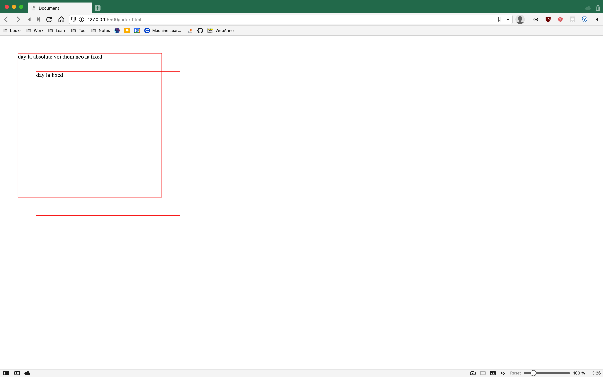
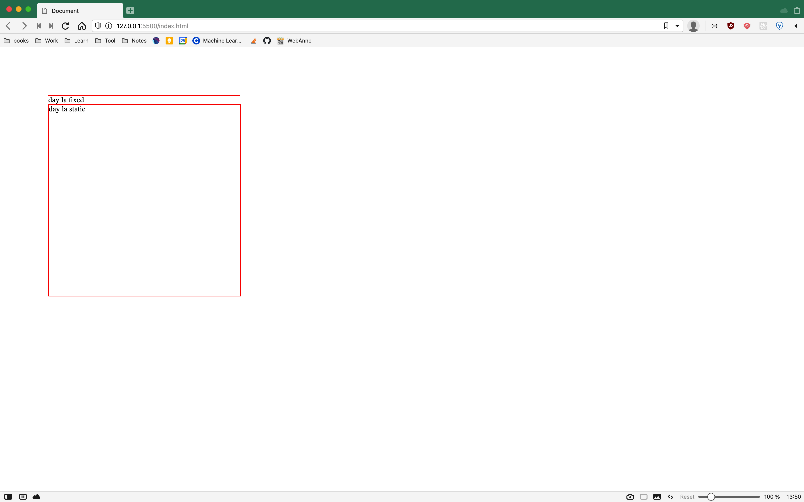

# CSS III
## Position
- Position là một thuộc tính quan trọng của CSS khi thực hiện việc căn chỉnh layout, giao diện. Postion giúp re-locate (đặt lại vị trí) của element trên trang web mà không ảnh hưởng tới element khác. Có 4 loại thuộc tính position cơ bản : static (mặc định cho tất cả element ), **relative**, **fixed**, **absolute**, **sticky** (thuộc tính static không tính nha các bạn).

Để sử dụng thành thạo được position thì sẽ cần hiểu một vài thứ sau:

- Anchor point: Điểm neo - là điểm làm mốc, trình duyệt sử dụng điểm (các điểm) này để làm mốc, sau đó chỉnh element cách xa ra điểm 1 khoảng xác định. Có tổng cộng 4 điểm neo lần lượt: left, right, top, bottom tương ứng là 4 property cần thiết để căn chỉnh vị trí điểm điểm neo. Điểm neo có thể là một element lớn hơn!
- 4 điểm neo phân vào 2 chiều: vertical (top & bottom) & horizontal (right & left). Khi căn chỉnh vị trí thì chỉ tồn tại tối đa 2 chiều có giá trị (tức là 2 chiều). Ví dụ: Nếu chỉnh lúc 2 giá trị thuộc cùng 1 chiều như **left** và **right** thì sẽ có 1 thuộc tính bị vô hiệu hoá, cụ thể là thuộc tính **top** và **left** sẽ được ưu tiên hơn.

Tuỳ thuộc vào từng giá trị của thuộc tính position mà có một cách xác định điểm neo khác nhau. 
- fixed: Điểm neo chính là toàn bộ viewport. 

```html
<style>
*{
    margin: 0;
    padding: 0;
}
body{
    width: 3000px;
    height: 3000px;
}
.square{
    width: 400px;
    height: 400px;
}
.border{
    border: 1px solid red;
}
.fixed{
    position: fixed;
    /* right: 100; */
    left: 100;
    /* bottom: 100; */
    top: 100;
}
</style>
 <div class="square border fixed">
    day la fixed
    <div class="square border rel">
        day la relative
    </div>
</div>
```

- absolute: Điểm neo là một element gần nhất (tính từ dưới lên theo cấu trúc DOM) mà thuộc tính position không phải là static. Nếu không có điểm neo hợp lệ (một positioned element - thuộc tính position khác static ) viewport được chọn là điểm neo tuy nhiên với 1 vị trí sẽ thay đổi khi việc cuộn trang xảy ra (page scrolling ), không hẳn là fixed.


```html
<style>
*{
    margin: 0;
    padding: 0;
}
body{
    width: 3000px;
    height: 3000px;
}
.square{
    width: 400px;
    height: 400px;
}
.border{
    border: 1px solid red;
}
.fixed{
    position: fixed;
    /* Với hình thứ 2 thì comment dòng ở trên lại */
    left: 100;
    top: 100; 
}
.abs{
    position: absolute;
    right: 50;
    left: 100;
    bottom: 50;
    top: 100;
}
</style>
 <div class="square border fixed">
    day la fixed
    <div class="square border abs">
        day la absolute nhung khong co diem neo phu hop
    </div>
</div>
```
- Nếu không có điểm neo phù hợp thì sẽ chọn viewport làm neo, tuy nhiên vị trí không giữ nguyên mà sẽ bị thay đổi khi cuộn trang.


- relative : Điểm neo chính là vị trí cơ bản (vị trí bình thường của element, static).


```html
<style>
    *{
        margin: 0;
        padding: 0;
    }
    body{
        width: 3000px;
        height: 3000px;
    }
    .square{
        width: 400px;
        height: 400px;
    }
    .border{
        border: 1px solid red;
    }
    .fixed{
        position: fixed;
        /* Với hình thứ 2 thì comment dòng ở trên lại */
        left: 100;
        top: 100; 
    }
    .rel{
        position: relative;
        top: 50;
        left: 50;
    }
</style>
    <div class="square border fixed">
    day la fixed
    <div class="square border rel">
        day la relative 
    </div>
</div>
```
- sticky: Lúc bình thường thì là static, còn khi có điều kiện đặc biệt thì sẽ là fixed (Điều kiện đặc biện là overflow). Thường hay sử dụng với Navigation bar.


---

## CSS function
- CSS cung cấp các function cơ bản giúp việc viết code dễ dàng hơn. Ví dụ hàm **calc** sẽ phụ trách việc tính toán các giá trị số học. Hàm **var** giúp tái sử dụng màu sắc, giá trị dễ dàng hơn

```css
:root{
    /* Các biến số phải khai báo ở đây. Tên biến phải bắt đầu bằng dấu --, các từ nối với nhau bằng dấu gạch nối -, thay vì dấu cách. Đây còn gọi là cách đặt tên kiểu xiên thịt (kebab-case) */
    --color-pri: #FE5F55;
    --color-sec: #FFF1C1
}
.square{
    width: 100%;
    height: calc(0.7*100px); 
    /* 70 px */
    background-color:var(--color-pri);
}

```

---

## CSS Properties
- Giới thiệu thêm về các CSS property quen thuộc, border-radius, background,....

---

## Font / Font Icon
- Có thể sử dụng các font chữ đa dạng của [google](https://fonts.google.com)
- Tìm hiểu về [font](http://designs.vn/tin-tuc/phong-chu-font-la-gi-_15381.html)
- Làm thế nào để sử dụng font cho css ở [w3school](https://www.w3schools.com/css/css_font.asp)
- Thay vì sử dụng hình nhỏ (16x16 px làm icon), ta có thể sử dụng CSS thuần, để tạo ra icon. Tuy nhiên cách này rất là cực, vì thế ta sẽ sử dụng thư viện icon riêng của [fontawesome](https://cdnjs.com/libraries/font-awesome)
- Cách sử dụng có thể tham khảo ở đây [icon](https://www.w3schools.com/css/css_icons.asp)

---

## Exercise:
- Thực hiện Survey form 2 (50%)
- Làm Just a Square & Crescent Moon
- Về nhà hoàn thiện Survey form 2
- 4 Corner & Button

## Reference & More Resources: 
* https://www.w3schools.com/css/css_positioning.asp
* https://developer.mozilla.org/en-US/docs/Web/CSS/position
* https://fonts.google.com
* http://designs.vn/tin-tuc/phong-chu-font-la-gi-_15381.html
* https://www.w3schools.com/css/css_font.asp
* https://cdnjs.com/libraries/font-awesome
* https://www.w3schools.com/css/css_icons.asp
* https://cdnjs.com/libraries/font-awesome


---
<!-- Navigator -->
<div>
<a href="./Lecture-02.4.CSS-II.md">
    
</a>
<a href="./README.md">
    
</a>
<a href="./Lecture-05.1.Introduction-to-Javascript.md">
    
    </a>
</div>
<!-- Navigator -->
