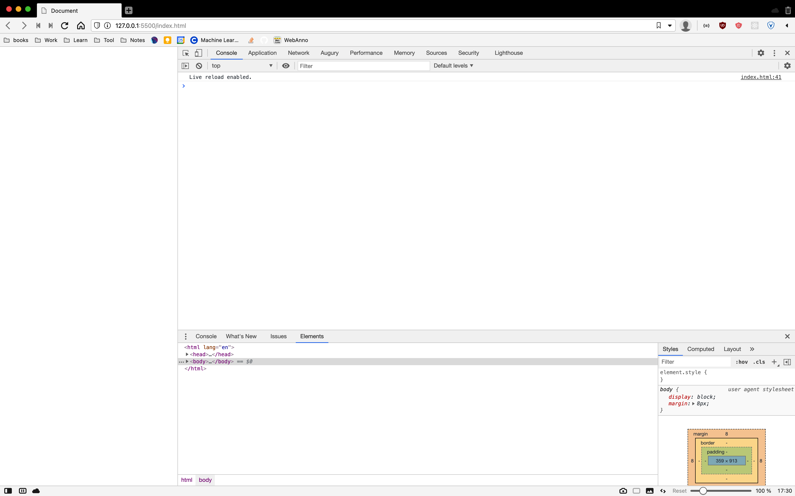

# Introduction to Javascript
## History
- Ban đầu, Web cực kỳ nhàm chán bởi vì chỉ có HTML, các trang web không có gì khác ngoài từ, liên kết và hình ảnh. Không có tính linh động, không thú vị, mọi thứ hoàn toàn là static. Giống như những trang HTML các bạn đã làm, rất chán. Vào năm 1995, tại văn phòng của Netscape, JavaScript đã ra đời.
- Được phát triển trong **10 ngày** bởi Brendan Eich (lãnh đạo của Mozilla), cho phép các developer viết code theo nhiều kiểu khác nhau (OOP,FP,SP,...) bằng một ngôn ngữ gần giống với các ngôn ngữ phổ biến khác ngày nay, như Java, C++ hay C.

- Mặc dù có tên tương tự, nhưng cần phải nhấn mạnh rằng, JavaScript không liên quan gì đến ngôn ngữ lập trình Java được phát triển bởi Sun Microsystems. Thật ra tại thời đó thì mục đích chính có tên JavaScript là để ăn theo độ nổi tiếng của Java

- Bởi vì chỉ được phát triển trong vòng 10 ngày, nên thực sự là độ hoàn chỉnh JavaScript (JS) còn rất là thấp, dẫn tới có rất nhiều sự khó hiểu ở bản thân JS và cách JS hoạt đông. Vì thế có nhiều phiên bản tốt hơn của JS được ra đời: TypeScript, Coffee,... nhằm hạn chế các lỗi cơ bản của JS

---

## Javascript
- Javascript là một ngôn ngữ kịch bản (scripting language) - tức là một ngôn ngữ chạy trực tiếp từng dòng lệnh ngay lập tức, thường đi kèm với một runtime environment (thường là một interpreter). Tăng hiệu suất và tốc độ, viết code ngắn gọn.

- JS gồm những **statement** (những lệnh, instructions). Statement gồm 5 loại : Values, Operators, Expressions, Keywords, and Comments.

- Comment trong JavaScript được viết như sau:

```js
// 1 line comment

/*
comment 
nhưng
mà 
nhiều
dòng
*/

```
- Keywords là những reserved word (từ được trưng dụng) nhằm mục đích thực hiện một chức năng nào đó. Tham khảo danh sách tại [google](https://www.w3schools.com/js/js_reserved.asp)

- Những thành phần còn lại là Values, Operators, Expressions. Thông thường thì sẽ được xem là cốt lõi của vấn đề, của ngôn ngữ lập trình. Sẽ được trình bày kỹ càng hơn.

## Giới thiệu về cách làm việc với JS
- Làm việc trực tiếp trên console của một trang web. Mở một file HTML bằng *Live server*, sau đó click chuột phải vào trang, chọn inspect (kiểm tra - phím tắt là *Ctrl + Shift + I* hoặc là *Cmd + Shift + I*)

Các trình duyệt khác nhau sẽ có từng developer tools khác nhau về giao diện tuy nhiên vẫn đảm bảo những nhu cầu tối thiểu. Lưu ý, Safari không hiển thị dev tool mặc định, phải tuỳ chỉnh thêm như ở [google](https://coolestguidesontheplanet.com/safari-web-developer-tools-show-dock-browser-window/)

- Đối với việc sử dụng console, có thể để ý dấu **>** , mang ý nghĩa thực hiện 1 statement trong javascript. Thông thường thì một statement sẽ có kết quả trả về mặc định là **undefined** nếu không có giá trị nào được thực hiện bởi việc tính toán.Ngược lại nếu có kết quả thì sẽ hiển thị ở console với dấu "<"


---

## Reference & More Resources: 
* https://quantrimang.com/javascript-la-gi-internet-co-the-ton-tai-ma-khong-co-javascript-hay-khong-131753
---
<!-- Navigator -->
<div>
<a href="Lecture-03.2.Position.md">
    
</a>
<a href="README.md">
    
</a>
<a href="Lecture-05.2.Values-Variable-DataType.md">
    
    </a>
</div>
<!-- Navigator -->