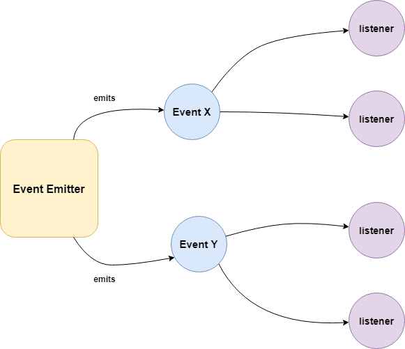

# Element object
- The Element object represents an HTML element, like P, DIV, A, TABLE, or any other HTML element.
- Bằng cách chọn những element sử các hàm có sẵn của **document**, ta có thể sử dụng các chúng để thao tác, xử lý

## element
- Một số **property** của element object đa phần đều được tạo ra từ HTML attribute (ví dụ như id,class,src,...) của các HTML tag khác nhau(mỗi tag có những attributes khác nhau), đa dạng và rất nhiều. Để nắm rõ về tất cả thì tham khảo thêm về HTML attribute.
- Một vài method/property hay sử dụng
```js
let el = document.getElementById("someid")

el.addEventListener()       // Thêm 1 hành động sẽ diễn ra khi event được kích hoạt
el.innerHTML                // Thay đổi toàn bộ phần nội dung ở bên trong opening & closing
el.value                    // Giá trị do người dùng nhập vào ở trong các tag nhằm mục đích thu thập thông tin (form)
el.classList                // Cho phép, thêm xoá sửa các class của element, thường để thay đổi cách hiển thị - Vd bấm nút like thì chuyển từ màu trắng sang màu xanh,...
el.insertAdjacentHTML()     // Chèn 1 đoạn mã HTML ở dạng string vào phần innerHTML của element - Rất mạnh, tiện sử dụng
el.
// ...
```
- Và một đống các property/method nữa. Các attribute thông thường sẽ giữ nguyên tên, muốn truy cập thì chỉ cần "chấm" (eg: el.id,..) đúng attribute là được. (lưu ý là vẫn có ngoại lệ)

---

## event
- Event là một Interface giúp các developer biết được các hành động của người dùng khi tương tác với trang web. Các Event được kích hoạt khi người dùng thực hiện các hành động tương tác với trang web (ví dụ: click, input,...)


- Event gồm
    - **emitter** , sẽ được kích hoạt, gửi 1 tín hiệu ngay khi người dùng tương tác, có hành động bất kỳ.   
    - **listener**, lắng nghe chờ tín hiệu được gửi từ emitter. Khi xác nhận có tín hiệu truyền tới, thực hiện hàm callback được developer chỉ định thông qua hàm **addEventListener()**. Mọi thông tin về **event** - tên event, data đi kèm, target,... là tham số nhận vào của các hàm **listener**

```js
el.addEventListener("click",function(ev)=>{
    console.log(ev)
})
// ev.target - đối tượng mà tín hiệu truyền tới - thông thường là một element object
```
- Tập trung vào việc tìm hiểu về các method/property của Event sẽ giúp cuộc đời tốt đẹp hơn!
---
## Exercise:

---

## Reference & More Resources: 
* https://www.w3schools.com/tags/ref_attributes.asp
* https://www.w3schools.com/jsref/dom_obj_all.asp
* https://developer.mozilla.org/en-US/docs/Web/API/Event
* https://developer.mozilla.org/en-US/docs/Web/API/Event/Comparison_of_Event_Targets

