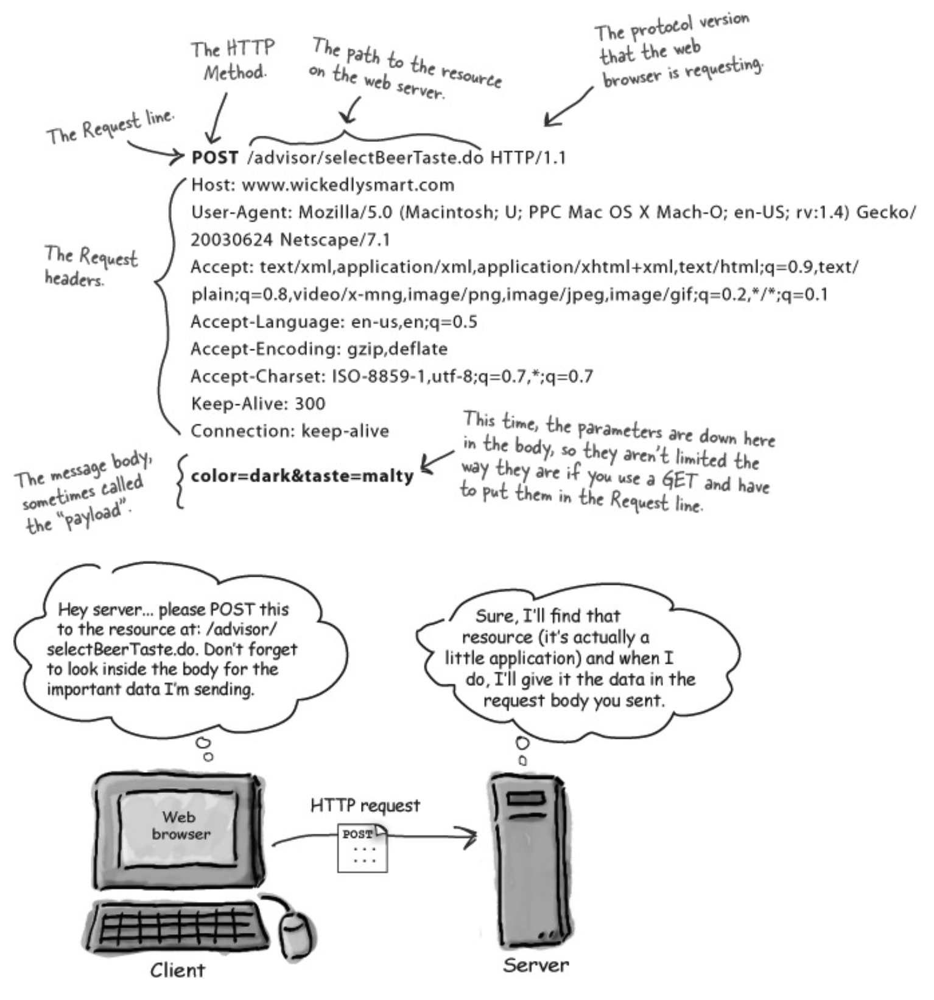
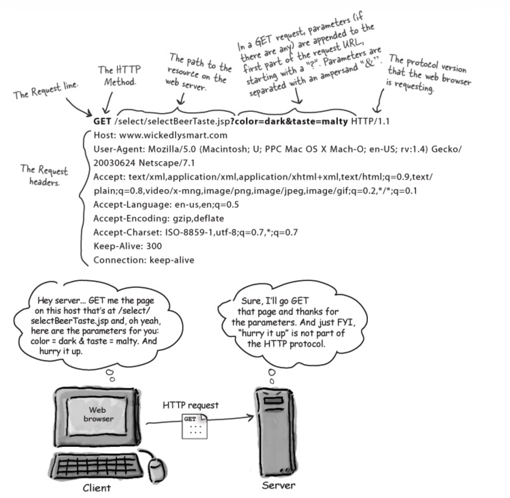
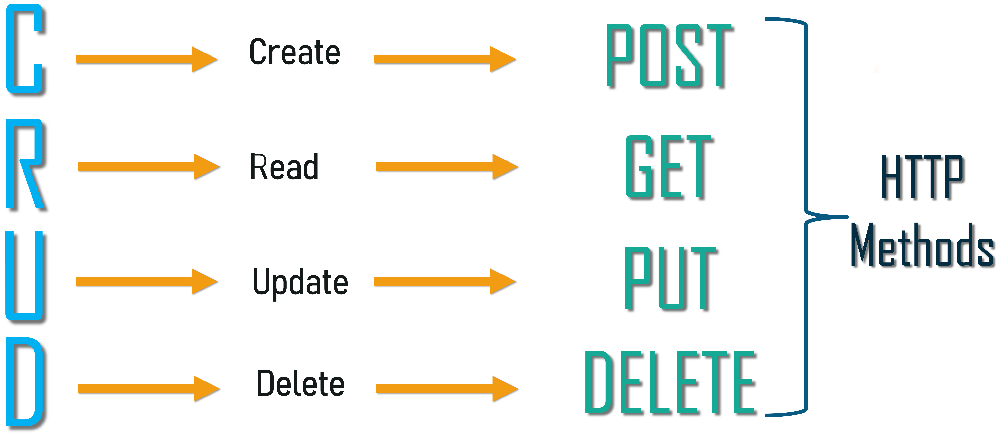
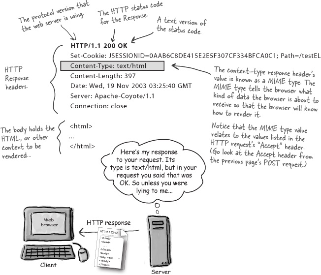

# Network
## HTTP
- HTTP là một giao thức mạng dùng để truyền tải dữ liệu sử dụng internet. Đồng thời cũng là giao thức nền tảng, xương sống của một trang web

- HTTP Request & Response thì sẽ có một số phần khác nhau. Tuy nhiên gồm 2 phần chính là Headers(ie: chứa một số thông tin về định dạng dữ liệu,...), Body (chứa dữ liệu)

---
## HTTP Request
- Các thành phần cơ bản của một HTTP request

- Khi thực hiện việc tạo một *request* thì ta cần chú ý các http method sẽ mang 1 ý nghĩa khác nhau

---
## HTPP status codes
- Các thành phần cơ bản của một HTTP response

- Các status code đồng thời cũng mang ý nghĩa riêng, tham khảo thêm ở các link bên dưới
---
## Reference & More Resources: 
- https://betterprogramming.pub/the-anatomy-of-an-http-request-728a469ecba9
- https://developer.mozilla.org/en-US/docs/Web/HTTP/Overview
- https://developer.mozilla.org/en-US/docs/Web/HTTP
- https://en.wikipedia.org/wiki/Hypertext_Transfer_Protocol
- https://developer.mozilla.org/en-US/docs/Web/HTTP/Methods
- https://developer.mozilla.org/en-US/docs/Web/HTTP/Status
---
<!-- Navigator -->

<!-- Navigator -->