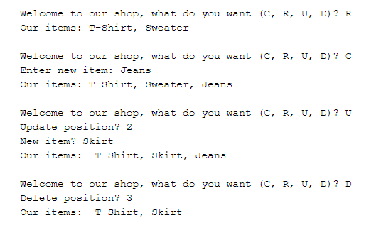

## C4E JS - Student book

### I. MẢNG LÀ GÌ? (ARRAY)
**1. Giới thiệu**  
-   Hãy tưởng tượng bạn là người viết chương trình quản lý menu các món ăn cho một nhà hàng. Bếp trưởng sẽ là người sử dụng phần mềm của bạn.

-   Ban đầu nhà hàng khai trương với một menu gồm 5 món ăn, bạn liệt kê chúng như sau:  
    ``` javascript
        let monAn1 = "com";
        let monAn2 = "thit";
        let monAn3 = "ca";
        let monAn4 = "trung";
        let monAn5 = "rau";
    ```

-   Một ngày đẹp trời, bếp trưởng muốn thêm món **bún** vào menu, lúc này bạn sẽ nghĩ ngay đến việc bật máy tính -> mở code ra -> khai báo thêm 1 biến mới để lưu thêm **bún** vào menu:  
    ``` javascript
        let monAn1 = "com";
        let monAn2 = "thit";
        let monAn3 = "ca";
        let monAn4 = "trung";
        let monAn5 = "rau"; 
        let monAn6 = "bun"; 
    ```

- Đến đây mọi chuyện vẫn ổn, chưa có gì khó khăn, nhưng bây giờ nhà hàng tuyển thêm 4 người phụ bếp nữa, mỗi người cảm thấy cần phải thêm một món mới của riêng họ vào menu. Lúc này thì có 1 vài vấn đề thực sự xảy ra:  
    -   Càng ngày nhu cầu thêm mới món ăn vào menu ngày càng nhiều, chưa kể sau một thời gian, có những món không mấy ai dùng, nhà hàng cần phải xóa khỏi menu, hoặc sửa thành món khác.

    -   Bạn không thể phân thân ra để phục vụ từng ấy con người, mỗi người một nhu cầu khác nhau, vào những thời điểm khác nhau.

    -   Giả sử bạn có thể đáp ứng được nhu cầu của các phụ bếp cũng như bếp trưởng một cách thủ công như vậy, thì việc lập trình cũng không còn ý nghĩa.

<!-- &rarr; May mắn thay, có một phương pháp để giải quyết vấn đề của bạn, đó là sử dụng **Array (Mảng)** -->
&rarr; **Array (Mảng)** được sinh ra để giải quyết vấn đề này. Với **Array**, bạn hoàn tự động hóa việc đáp ứng tất cả những hành động, nhu cầu như thêm, sửa, xóa món ăn của bất kỳ ai, vào bất kỳ thời điểm nào.

**2. Khái niệm**  
-   **Array** là một phương pháp dùng để lưu trữ nhiều dữ liệu trong một biến.

-   **Array** được dùng để lưu trữ dữ liệu, vậy nên **Array** cũng được tính là 1 **Kiểu Dữ Liệu**.

**3. Cú pháp**  
``` javascript
    let monAn = ["com", "thit", "ca", "trung", "rau"];
```

-   **monAn** được gọi là một **Array**.

-   Tất cả các món ăn (phần tử) được liệt kê trong cặp ngoặc vuông ([]), ngăn cách nhau bởi dấu phẩy (,)

### II. CÁC THAO TÁC VỚI MẢNG (ARRAY)

-   Khi học về một **Kiểu Dữ Liệu** mới, ngoại trừ những **Kiểu Dữ Liệu** cơ bản chỉ lưu được một dữ liệu đơn (như **String**, **Number**, ...), thì sẽ cần phải học 4 kỹ năng cơ bản sau đây để có thể làm việc thành thạo được với nó:

    -   <b><u>C</u></b>reate: **Thêm mới** dữ liệu.
    -   <b><u>R</u></b>ead: **Đọc, truy cập** dữ liệu.
    -   <b><u>U</u></b>pdate: **Cập nhật** dữ liệu.
    -   <b><u>D</u></b>elete: **Xóa** dữ liệu.

-   Trước khi đi vào học 4 thao tác trên, bạn cần phải nắm được khái niệm **Độ Dài Của Mảng (Length)**

    ``` javascript
        let monAn = ["com", "thit", "ca", "trung", "rau"];
    ```

    Trong **Array monAn**, bằng mắt thường bạn có thể dễ dàng thấy có 5 món ăn. Tuy nhiên hãy thử tưởng tượng **Array monAn** chứa hàng chục thậm chí hàng trăm món ăn, chắc chắn là bạn không đủ kiên nhẫn để đếm xem **Array monAn** chứa bao nhiêu món ăn.

    &rarr; JS cung cấp cho bạn một cách để có thể nhanh chóng biết được số lượng phần tử có trong một **Array**:  

    ``` javascript
        let monAn = ["com", "thit", "ca", "trung", "rau"];
        let soLuongMonAn = monAn.length;

        console.log(soLuongMonAn) // 5
    ```

-   Sau khi đã nắm được cách kiểm tra số lượng phần tử có trong một **Array**, chúng ta đã có thể sẵn sàng để làm quen với 4 thao tác cơ bản như đã giới thiệu ở trên.

**1. Create**  

-   Đây là thao tác **thêm mới phần tử** vào **Array**, trong thực tế thì mỗi khi có một phần tử được thêm mới vào **Array**, thì hầu hết trong mọi tình huống nó sẽ được thêm vào cuối **Array**. Vì vậy trong bài này sẽ chỉ nhắc đến cách thêm phần tử vào cuối **Array**. Cú pháp như sau:  

    ``` javascript
        let monAn = ["com", "thit", "ca", "trung", "rau"];
        monAn.push("bun dau");

        console.log(monAn); // ["com", "thit", "ca", "trung", "rau", "bun dau"]
    ```

-   Trong ví dụ trên, sau khi thực hiện câu lệnh **monAn.push("bun dau")**, **array monAn** sẽ có thêm 1 phần tử **"bun dau"** nằm ở cuối cùng.


***Bài tập***:  
-   In ra màn hình 1 Array chứa tên của 3 cầu thủ bóng đá: Ronaldo, Messi, Neymar. 

-   Hỏi người dùng có muốn nhập thêm cầu thủ không bằng cách nhập "Y" hoặc "N".

-   Nếu người dùng nhập "Y", hỏi tiếp tên cầu thủ muốn nhập, sau đó thêm cầu thủ mới vào Array ban đầu và in Array mới ra màn hình

-   Nếu người dùng nhập "N", in ra màn hình câu "Good Bye!"

**2. Read**  

-   Đây là thao tác **Đọc**, hay còn gọi là **Truy cập**.

-   Một phần tử trong **Array** sẽ được truy cập thông qua **chỉ số (index)**.
-   Các phần tử trong **Array** được đánh số thứ tự từ trái qua phải, **bắt đầu từ 0**. Số thứ tự của 1 phần tử được gọi là **chỉ số (index)** của phần tử.
-   Ví dụ:
    ``` javascript
        let monAn = ["com", "thit", "ca", "trung", "rau"];
    ```
    -   "com" mang **index** là 0.
    -   "thit" mang **index** là 1.  
    -   "ca" mang **index** là 2.  
    -   "trung" mang **index** là 3.
    -   "rau" mang **index** là 4.

-   **Truy cập một phần tử:**  
    -   Cú pháp **truy cập** một phần tử thông qua **index tương ứng** như sau:  
    ``` javascript
        let monAnDauTien = monAn[0];
        console.log(monAnDauTien) // com
    ```

    &rarr;   Điền **index** vào trong cặp ngoặc vuông ([]), giá trị tương ứng sẽ được lấy ra. Cụ thể trong trường hợp trên, điền 0 vào trong cặp ngoặc vuông ([]), giá trị "com" tương ứng với **index 0** sẽ được lấy ra.

    ***Bài tập:***

    -   Tạo ra 1 Array chứa tên của các hãng xe: Honda, Suzuki, Yamaha, Kawasaki, Ducati, Triumph.

    -   In ra màn hình "Ducati"

-   **Truy cập tất cả phần tử:**
    -   Trên thực tế, nhắc đến **Array** là người lập trình sẽ có xu hướng nghĩ ngay đến việc kết hợp với **Loop** với mong muốn duyệt qua hết tất cả các phần tử có trong **Array**. Cụ thể ở đây là **For Loop**.
    -   Cú pháp:  
        ``` javascript
            let monAn = ["com", "thit", "ca", "trung", "rau"];

            for (let i = 0; i < monAn.length; i++) {
                console.log(i); // 0 1 2 3 4
            }
        ```
    &rarr; Tạo ra một **vòng lặp for** với biến khởi tạo **i=0**, chừng nào i vẫn còn nhỏ hơn độ dài của monAn (**i < monAn.length**) thì i vẫn còn được phép tăng (**i++**). Bên trong chỉ đơn giản là **in ra i**.

    &rarr; Giải thích một chút ở phần **i < monAn.length**:

    -   **monAn.length** là **độ dài** (hay **số lượng phần tử**) của **monAn**, tức là 5.
    -   Phần tử cuối cùng của **monAn** là **rau** mang **chỉ số** (i) là 4. 
    -   Vậy **i < monAn.length** có nghĩa là người lập trình đang muốn **i chạy từ phần tử đầu tiên cho đến phần tử cuối cùng của Array**. Chỉ số của phần tử cuối cùng trong một **Array** luôn nhỏ hơn độ dài của Array 1 đơn vị.

    &rarr; Có thể dễ dàng nhận thấy, biến i ở trong vòng lặp đại diện cho **chỉ số** của từng phần tử trong **monAn**. Vậy để lấy ra giá trị của phần tử, chúng ta chỉ đơn giản sửa như sau: 
    ``` javascript
            let monAn = ["com", "thit", "ca", "trung", "rau"];
            
            for (let i = 0; i < monAn.length; i++) {
                console.log(monAn[i]); // com thit ca rau trung
            }
    ```

    ***Bài tập:*** 
    -   Tạo ra 1 Array chứa tên của các hãng xe ô tô: Audi, Bentley, BMW, Bugatti, Ferrari, Ford.

    -   In ra màn hình tất cả các hãng xe có trong Array vừa tạo.

**3. Update**  
-   Đây là thao tác **Cập nhật** giá trị mới cho một phần tử trong Array.

-   Cú pháp:  
    ``` javascript
        let monAn = ["com", "thit", "ca", "trung", "rau"];
        monAn[0] = "chao";
        console.log(monAn) // chao thit ca trung rau
    ```
-   Chỉ đơn giản là truy cập vào phần tử muốn thay đổi, sau đó gán cho nó một giá trị mới, như cách bạn đặt giá trị cho biến.

***Bài tập:***  
-   In ra màn hình 1 Array chứa tên của 3 cầu thủ bóng đá: Ronaldo, Messi, Neymar. 

-   Hỏi người dùng có muốn nhập thay đổi tên cầu thủ nào không bằng cách nhập "Y" hoặc "N".

-   Nếu người dùng nhập "Y":
    -   Hỏi người dùng vị trí của cầu thủ muốn thay đổi tên. Người dùng nhập 0 thì sẽ là Ronaldo, nhập 1 thì sẽ là Messi, Nhập 2 thì sẽ là Neymar.

    -   Hỏi người dùng tên cầu thủ mới.

    -   Tiến hành cập nhật tên cầu thủ mới thay thế cho cầu thủ cũ được chọn.
    
-   Nếu người dùng nhập "N", in ra màn hình câu "Good Bye!"

**4. Delete**  
-   Đây là thao tác **Xóa** một phần tử ra khỏi **Array**.
-   Cú pháp: 
    ``` javascript
        let monAn = ["com", "thit", "ca", "trung", "rau"];
        monAn.splice(0, 1);
        console.log(monAn); // thit ca trung rau
    ```
-   Câu lệnh **monAn.splice(0, 1)** được giải thích như sau:  
    -   Bắt đầu từ vị trí **0** của **Array monAn**, hãy **splice** (xóa) đi **1** phần tử.
    -   Vậy **monAn** sẽ chỉ còn là:  
    ``` javascript
        let monAn = ["thit", "ca", "trung", "rau"];
    ```
-   Nếu sửa câu lệnh trên thành **monAn.splice(1, 2)**, giải thích như sau:  
    -   Bắt đầu từ vị trí **1** của **Array monAn**, hãy **splice** (xóa) đi **2** phần tử.
    -   Vậy **monAn** sẽ chỉ còn là:  
    ``` javascript
        let monAn = ["com", "trung", "rau"];
    ```

***Bài tập:***  
-   In ra màn hình 1 Array chứa tên của 3 cầu thủ bóng đá: Ronaldo, Messi, Neymar. 

-   Hỏi người dùng có muốn xóa cầu thủ nào không bằng cách nhập "Y" hoặc "N".

-   Nếu người dùng nhập "Y":
    -   Hỏi người dùng vị trí của cầu thủ muốn xóa. Người dùng nhập 0 thì sẽ là Ronaldo, nhập 1 thì sẽ là Messi, Nhập 2 thì sẽ là Neymar.

    -   Tiến hành xóa cầu thủ được chọn.
    
-   Nếu người dùng nhập "N", in ra màn hình câu "Good Bye!"


### III. BÀI TẬP
Trên thực tế, khi nhận yêu cầu để làm sản phẩm, bạn cũng sẽ chỉ biết được người dùng muốn gì thôi, sẽ không có ai chỉ cho bạn từng bước làm cụ thể. Hình dưới đây chụp lại quá trình sử dụng chương trình của người dùng:  

  

&rarr; Dựa vào hình trên, hãy viết một chương trình mô phỏng cửa hàng quần áo như hình trên.

*Bài tiếp theo [Đối tượng (Object)](../object/object.md)*
