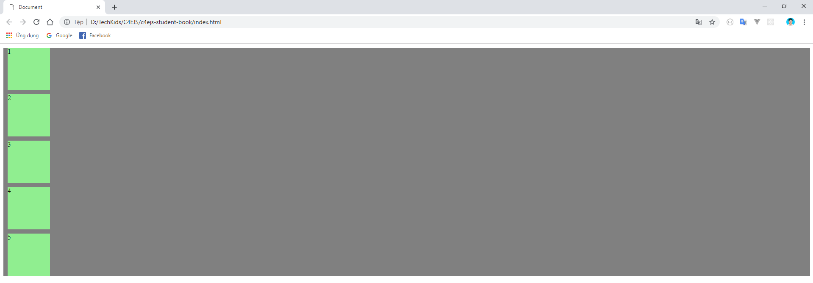

## C4E JS - Student book

### VI. CSS FLEXIBLE BOX?
**1. Giới thiệu**

-   Bản chất cả trang web của bạn là một "chiếc hộp"(box) lớn, bên trong chứa rất nhiều các phần tử nhỏ, mỗi phần tử nhỏ đó lại là những box nhỏ hơn:

    

-   Hình trên là một phần của trang **facebook.com**, đường viền màu xanh là cả một box lớn chứa toàn bộ nội dung bên trong. Bên trong nó là những box nhỏ hơn màu đỏ, đại diện cho từng phần nội dung bên trong.

-   Khi muốn sắp xếp, phân chi bố cục của trang web, thực chất là bạn đang làm việc với từng box, đó có thể là box nằm ngang, box dựng thẳng đứng,...

-   Tất cả những lý do trên đủ để chứng minh mức độ cần thiết của **Flexible Box**

**2. Khái niệm**

-   Flexible box hay còn gọi là Flexbox, là một tính năng mạnh mẽ của CSS cung cấp một cách hiệu quả việc bố trí, sắp xếp và cân đối không gian giữa các phần tử trong một box.

-   Flexbox bao gồm 2 phần chính:
    -   **Flex container**: đây chính là chiếc hộp chứa các phần tử bên trong nó.
    -   **Flex items**: các phần tử bên trong **Flex container**

**3. Cài đặt**
-   Để dễ dàng và thuận tiện trong việc tìm hiểu Flexbox, chúng ta sẽ cần phải dựng lên một tình huống mô phỏng việc sử dụng flexbox. Ở đây cụ thể sẽ là một chiếc hộp với 5 phần tử bên trong nó.

-   Ở file HTML, bạn tạo ra một đoạn code như sau:
    ```html
        <div id="flex-box-demo">
            <div>1</div>
            <div>2</div>
            <div>3</div>
            <div>4</div>
            <div>5</div>
        </div>
    ```
-   Đoạn code trên bao gồm một thẻ `<div></div>` to nhất với `id="flex-box-demo"`, đại diện cho một chiếc hộp to nhất, chứa 5 phần tử tương đương với 5 thẻ div bên trong, nội dung là các số lần lượt từ 1 đến 5. Mở file HTML trên trình duyệt, chúng ta được kết quả sau:

    

-   Tiếp theo, chúng ta sẽ cung cấp cho thẻ `<div id="flex-box"></div>` một màu nào đó để dễ nhìn, ở đây sử dụng màu xám (gray). Bạn mở file css và viết cho id `flex-box-demo` và được kết quả như sau:
    ```css
        #flex-box-demo {
            background-color: gray;
        }
    ```
    

-   Các phần tử bên trong thẻ `<div id="flex-box"></div>` hiện tại đang là các con số, để dễ hình dung hơn thì chúng ta sẽ biến đổi những con số này thành những hình vuông có màu sắc.

-   Chúng ta sẽ chỉ viết css để tạo ra hình vuông có màu sắc một lần thôi và áp dụng cho cả 5 thẻ div bên trong, vì vậy ở file css, bạn viết một class tên là `flex-items` (bạn có thể đặt tên tùy thích) với các declaration như sau:

    ```css
        .flex-items {
            background-color: lightgreen;
            width: 100px;
            height: 100px;
            margin: 10px;
        }
    ```
-   Với các declaration như trên, chúng ta đang mong muốn những thẻ nào sở hữu class này sẽ có màu nền là màu lightgreen `(background-color: lightgreen)`, có độ dài là 100 pixel `(width: 100px)` và chiều rộng cũng là 100 pixel `(height: 100px)`. 
-   Ngoài ra, để làm cho các hộp không bị dính sát nhau bằng cách thêm declaration `margin: 10px`. Property `margin` cho một phần tử được sử dụng để điều chỉnh khoảng cách giữa phần tử đó với các phần tử xung quanh **trong cùng bậc**. Bạn có thể tìm hiểu thêm về property margin tại [đây](https://www.w3schools.com/css/css_margin.asp).

-   Áp dụng class `flex-items` với 5 thẻ div nhỏ bên trong và được kết quả như sau:
    ```html
        <div id="flex-box-demo">
            <div class="flex-items">1</div>
            <div class="flex-items">2</div>
            <div class="flex-items">3</div>
            <div class="flex-items">4</div>
            <div class="flex-items">5</div>
        </div>
    ```

    

-   Bước cuối cùng trong phần cài đặt, đó là bạn phải chỉ định thẻ `<div id="flex-box"></div>` là một **flexbox** bằng cách sử dụng property `display` với value là `flex` như sau:
    ```css
        #flex-box-demo {
            background-color: gray;
            display: flex;
        }
    ```
    

-   Sau khi chỉ định thẻ div to bên ngoài `display: flex`, các phần tử bên trong sẽ tự động nằm ngang như hình.

### VII. CÁC PROPERTY CƠ BẢN TRONG FLEXBOX

-   Các phần tử bên trong sẽ bị tác động bởi những declaration của chiếc hộp chứa nó. Chính vì vậy, khi làm việc với flex-box, bạn sẽ chỉ phải viết css cho chiếc hộp bọc các phần tử bên trong.

**1. flex-direction**
-   Một **Flex container** có hai trục: một trục chính (main axis) và một trục dọc vuông góc với trục chính (cross axis) mặc định hiển thị như dưới đây:

    

-   Mặc định, các **Flex items** được sắp xếp theo hướng của trục chính, từ trái qua phải. Đây là lí do tại sao các ô vuông hiển thị trên cùng một dòng khi bạn sử dụng `display: flex`.

-   Property đầu tiên chúng ta sẽ tìm hiểu đó là `flex-direction`. Property này quyết định trục chính của **Flex container**. `flex-direction` sẽ có 4 value, sử dụng value nào sẽ tùy thuộc vào tình huống của bạn:
    -   row (giá trị mặc định): các phần tử bên trong sẽ được xếp theo thứ tự từ trái sang phải. Vị trí của 5 phần tử được xếp bên trái của chiếc hộp. 

    -   row-reverse: các phần tử bên trong sẽ được xếp theo thứ tự từ phải sang trái. Vị trí của 5 phần tử được xếp bên phải của chiếc hộp. 

    -   column: Vị trí, cách sắp xếp giống như value `row`, nhưng sẽ là từ trên xuống dưới.

    -   column-reverse: Vị trí, cách sắp xếp giống như value `row-reverse`, nhưng sẽ là từ dưới lên trên.

-   Ví dụ sử dụng `flex-direction: row-reverse`:
    ```css
        #flex-box-demo {
            background-color: gray;
            display: flex;
            flex-direction: row-reverse;
        }
    ``` 
    

**2. flex-wrap**
-   Mặc định, tất cả các **Flex items** đều sẽ được sắp xếp chỉ trên một dòng, nếu trên dòng đó có quá nhiều items, thì kích cỡ của các items sẽ tự động bé lại, sao cho vừa đủ để đứng cùng nhau trên một dòng. Để dễ hình dung, bạn hãy thêm 10 phần tử nữa trong file HTML như sau:
    ```html
        <div id="flex-box-demo">
            <div class="flex-items">1</div>
            <div class="flex-items">2</div>
            <div class="flex-items">3</div>
            <div class="flex-items">4</div>
            <div class="flex-items">5</div>
            <div class="flex-items">1</div>
            <div class="flex-items">2</div>
            <div class="flex-items">3</div>
            <div class="flex-items">4</div>
            <div class="flex-items">5</div>
            <div class="flex-items">1</div>
            <div class="flex-items">2</div>
            <div class="flex-items">3</div>
            <div class="flex-items">4</div>
            <div class="flex-items">5</div>
        </div>
    ```
    

-   Trong trường hợp bạn muốn giữ nguyên kích thước của các **Flex items**, thì sẽ có một giải pháp, đó là nếu các phần tử đã chiếm hết chỗ trên một dòng, thì các phần tử còn lại sẽ xếp sang **dòng tiếp theo, liền kề với dòng hiện tại**. Property `flex-wrap` sẽ giúp bạn làm điều này.

-   `flex-wrap` sẽ có 3 value, sử dụng value nào sẽ tùy thuộc vào tình huống của bạn:
    -   nowrap (giá trị mặc định): Tất cả các **Flex items** sẽ co lại vừa đủ hiển thị trên một dòng.
    -   wrap: **Flex items** sẽ xuống dòng nếu như dòng hiện tại đã bị các **Flex items** trước đó chiếm hết chỗ, theo chiều từ trên xuống dưới.
    -   wrap-reverse: giống với `wrap`, nhưng là từ chiều từ dưới lên trên.

-   Ví dụ sử dụng `flex-wrap: wrap`:
    ```css
        #flex-box-demo {
            background-color: gray;
            display: flex;
            flex-direction: row-reverse;
            flex-wrap: wrap;
        }
    ``` 
    

**3. justify-content**
-   Property này quyết định vị trí giữa các **flex items** với nhau và với **flex container** **<i>theo trục chính</i>**.
-   `justify-content` có tất cả 6 value, tác dụng của mỗi value sẽ được thể hiện qua hình dưới đây:

    

-   Ví dụ sử dụng `justify-content: center`, các phần tử sẽ được xếp ra chính giữa như sau:
    ```css
        #flex-box-demo {
            background-color: gray;
            display: flex;
            flex-direction: row-reverse;
            flex-wrap: wrap;
            justify-content: center;
        }
    ```
    

**4. align-items**
-   Nếu bạn đã nắm được cách sử dụng property `justify-content` thì bạn sẽ không gặp khó khăn khi sử dụng `align-items`. Property này có tác dụng giống như `justify-content`, chỉ khác ở chỗ là `align-items` áp dụng cho trục phụ (vuông góc với trục chính). `algin-items` có 5 value:
    -   flex-start
    -   flex-end
    -   center
    -   stretch
    -   baseline
-   3 value đầu tiên giống hệt với 3 value của `justify-content`.
-   `align-items: stretch` khiến cho các phần tử mở rộng kích thước, chiếm hết chiều rộng (hoặc dài) của **Flex container**. Các phần tử chiếm chiều dài hay rộng là tùy thuộc vào trục chính đang là trục nào. Ví dụ (bạn hãy bỏ `height: 100px` của class flex-items đi, nếu không bỏ đi thì các items sẽ bị fix cứng height là 100px, khiến cho `align-items: stretch` mất tác dụng):
    ```css
        #flex-box-demo {
            background-color: gray;
            display: flex;
            flex-direction: row-reverse;
            flex-wrap: wrap;
            justify-content: center;
            align-items: stretch;
        }
    ```
    

-   `align-items: baseline` làm cho các phần tử cùng nằm trên đường `baseline`:

    

-   Đường `baseline` chính là đường màu đỏ trong hình trên.

### VIII. BÀI TẬP

-   Trên đây là một vài property cơ bản để bạn có thể làm quen và hiểu được cơ chế hoạt động của Flex box. Để có thể thành thạo được Flex-box, bạn hãy đọc kỹ luật chơi và vượt qua 24 level của trò chơi dưới đây.

    &rarr; [Flex-box Froggy Game](https://flexboxfroggy.com)