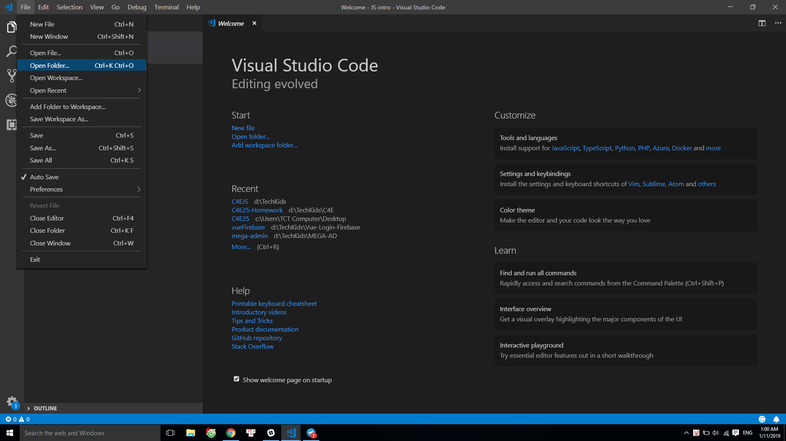
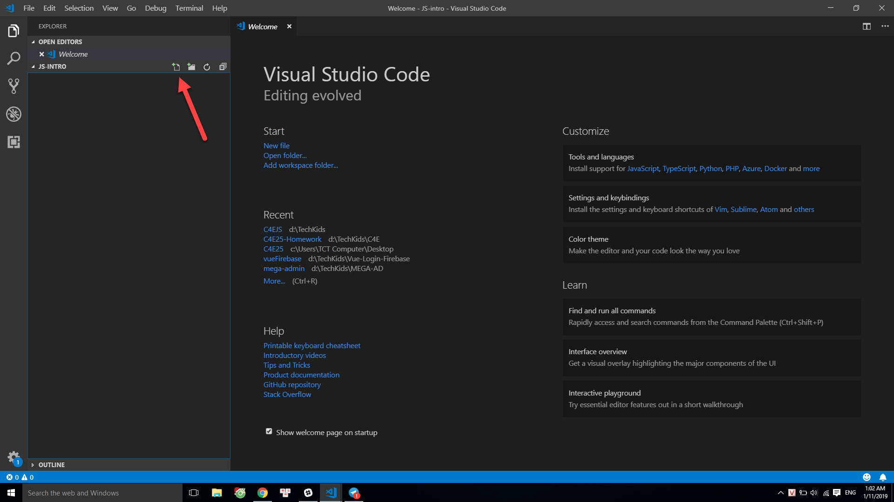
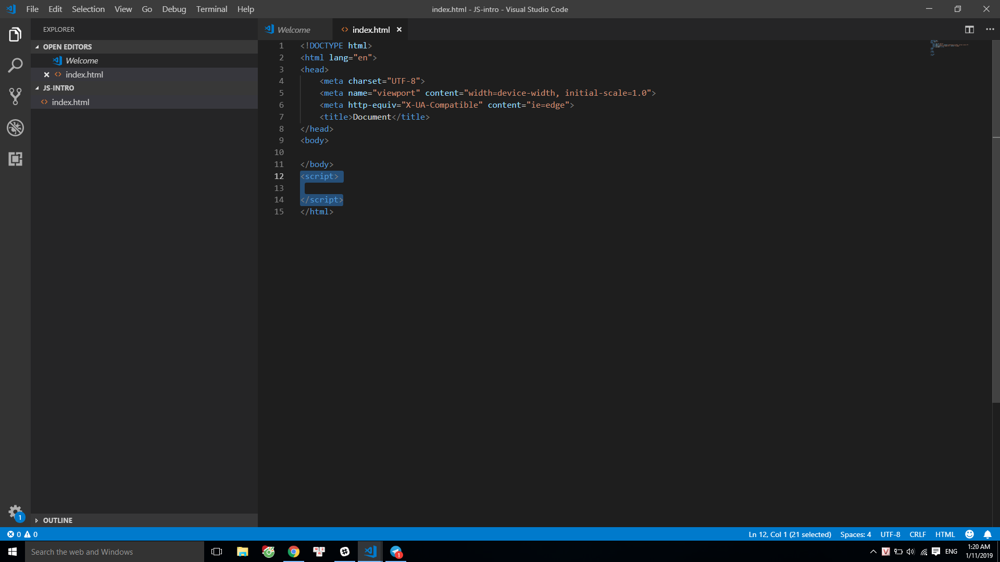
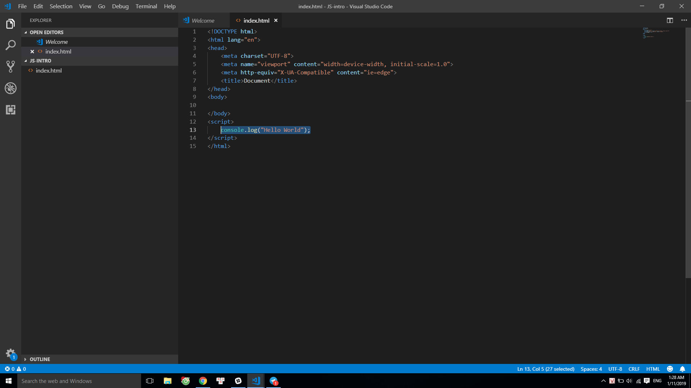
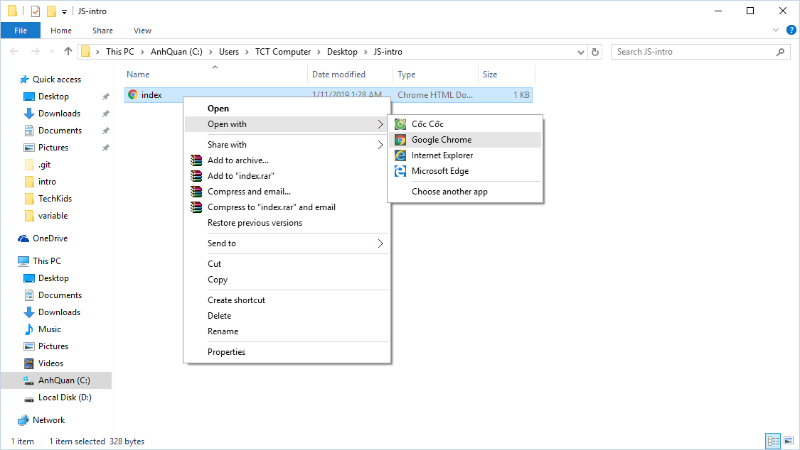
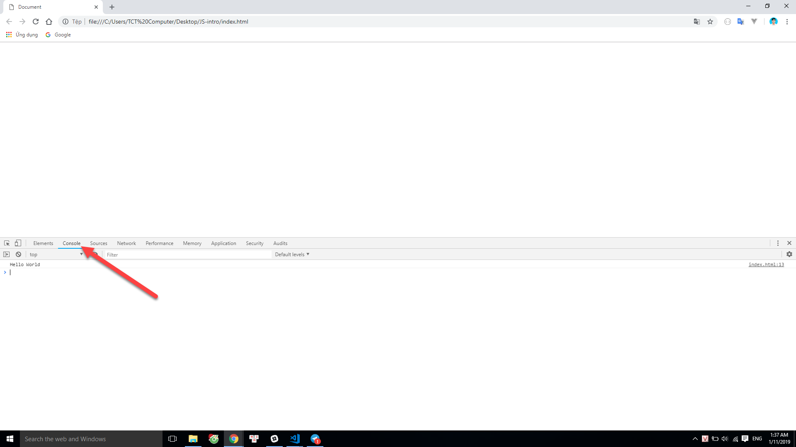

## C4E JS - Student book
### Giới thiệu khoá học

**I. JAVASCRIPT là gì?**
-   **JavaScript** (JS) là một ngôn ngữ lập trình cho phép thực hiện những điều phức tạp xuất hiện trên một trang web.

-   Mỗi khi bạn nhìn thấy một trang web thực hiện nhiều điều thú vị hơn là chỉ hiển thị thông tin, ví dụ như đồng hồ đếm ngược, hiệu ứng 2D/3D, tương tác với các thanh menu trượt ngang, dọc, v.v.. thì bạn có thể chắc chắn rằng, trang web đó có sự tham gia của **JavaScript** (JS)

-   **JavaScript** cùng với 2 ngôn ngữ khác là **HTML** và **CSS**, đã tạo nên một "bộ ba" không thể thiếu trong bất kỳ một trang web nào ngày nay. Để có thể dễ hình dung, bạn có thể tưởng tượng như sau: Nếu **HTML** là một cô gái không mấy xinh đẹp, thì **CSS** sẽ giúp cô ấy trở nên xinh đẹp hơn, tuy nhiên lúc này cô gái không hề biết cử động, không trả lời khi được hỏi, đây chính là lúc cần tới **JavaScript**(), JS sẽ giúp cô gái trở nên sống động hơn, có hồn, trở thành một cô gái hoàn hảo.

- Cô gái có thể không cần quá xinh đẹp, nhưng phải biết cử động. Trước khi có 1 cô gái biết cử động, chúng ta cần phải có cô gái trước đã. Nói như vậy để các bạn thấy rằng, muốn có **JavaScript**, trước hết chúng ta phải có **HTML**.

**II. CÀI ĐẶT CÁC CÔNG CỤ CẦN THIẾT**
-   HTML, CSS, và JavaScript hiện nay đã rất phổ biến, xuất hiện trên 99.99% các trang web và trình duyệt hiện nay. Vì vậy nên tất cả các **code editor** hiện nay đều đã hỗ trợ sẵn 3 loại ngôn ngữ này, tất cả những gì bạn cần làm chỉ là cài đặt một **code editor** để phục vụ cho việc viết code, là đã có thể bắt tay vào làm quen với code rồi.

-   Đề xuất: Các bạn có thể tải và cài đặt  Visual Studio Code (VS Code) [tại đây](https://code.visualstudio.com/)

**III. CHƯƠNG TRÌNH JAVASCRIPT đầu tiên**

-   Như đã nói phía trên, trước hết chúng ta phải tạo ra file **HTML** trước khi có thể tiếp cận **JavaScript**

-   Giao diện của VS Code:  

      

-   Chọn "File" -> "Open Folder..." phía góc trên bên trái màn hình, sau đó chọn tới thư mục bạn muốn lưu code trên máy:  

     

-   Bấm chọn biểu tượng tạo file mới sau đó đặt tên với đuôi .html, ở đây mình đặt là "index.html". Nếu tạo file với đuôi đúng là .html, thì bên cạnh tên file sẽ xuất hiện biểu tượng hình kim cương (<>)

     

-   Sau khi tạo file, bạn click vào file để mở và bắt đầu thực hiện việc code. Gõ "html" để xuất hiện gợi ý như trong hình, sau đó chọn vào dòng "html:5" và ấn phím Enter, kết quả sẽ là một đoạn khung HTML được dựng sẵn. 

    ***Vì lý do HTML quá phổ biến hiện nay nên hầu hết các code editor đều đã xây dựng sẵn một bộ khung HTML nhằm giảm thiểu thời gian phải code, thứ mà bất kỳ lúc nào tạo ra file HTML bạn cũng sẽ đều phải gõ lại y hệt như vậy.***
    
     

-   Nếu bạn đang thắc mắc với những gì vừa hiện ra trên màn hình, **đừng lo lắng**, tất cả những thành phần của HTML sẽ được trình bày một cách cụ thể và chi tiết khi chúng ta bắt đầu học cách tương tác JS với HTML.  

-   Hãy thêm đoạn code đang bôi đậm trong hình vào file HTML của bạn, bằng cách gõ "script" và bấm Enter 3 lần.

     

-   Hãy đưa con trỏ chuột vào dòng số 13, tất cả code JavaScript sẽ được viết ở đây (nằm giữa cặp "Script"). Chúng ta sẽ viết chương trình đầu tiên với JS, chương trình kinh điển mà bạn sẽ gặp mỗi khi học một ngôn ngữ lập trình bất kỳ, đó là in ra dòng chữ "Hello World".

-   Để làm điều này, hãy viết câu lệnh "console.log("Hello World")" như trong hình, đây là câu lệnh để in ra dòng chữ "Hello World".  

-   Dấu chấm phẩy ( ; ) không có ý nghĩa trong việc chạy code JavaScript, bạn có thể có hoặc không, code vẫn chạy bình thường. Tuy nhiên khi file code của bạn lớn dần lên thì dấu chấm phẩy là rất cần thiết, góp phần giúp cho code trở nên sáng sủa hơn rất nhiều.

     

-   Để chạy dòng code JS vừa viết, bạn hãy tìm đến folder chứa file .html mà bạn tạo lúc đầu, sau đó sử dụng trình duyệt (browser) trên máy bạn để mở file .html (chrome, firefox, Cốc Cốc, Safari) bằng cách chuột phải vào file -> Open with -> chọn browser bạn muốn sử dụng, ở đây mình chọn Google Chrome

    *Khuyến cáo không sử dụng trình duyệt Internet Explorer (IE)*
    
    *Trước khi định chạy bất kỳ một đoạn code nào, bạn hãy ấn tổ hợp phím Ctrl+S để VSCode lưu lại nội dung code bạn vừa thay đổi*
     

-   Một cửa sổ trên browser hiện ra, bạn click chuột phải vào bất kỳ chỗ nào trong phạm vi của trang, chọn "Kiểm tra" (Inspect hoặc Inspect Element), sau đó chuyển sang tab "Console" (Dòng chữ Inspect và vị trí của tab Console có thể khác nhau trên những browser khác nhau).

     

     

-   Ngay phía dưới bạn sẽ thấy dòng chữ "Hello World" hiện ra, đó chính là kết quả của những gì bạn đã làm từ đầu tới giờ.

    ***Bài tập***  
    Hãy tạo mới một file .html, trong đó sử dụng JavaScript, in ra màn hình console thông tin cá nhân, bao gồm tên, tuổi, địa chỉ, số điện thoại.
    [Lời giải](excercise_solution.md)

*Bài tiếp theo [Biến (Variables)](../variables/variables.md)*