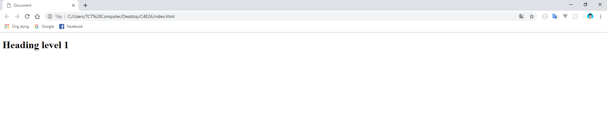
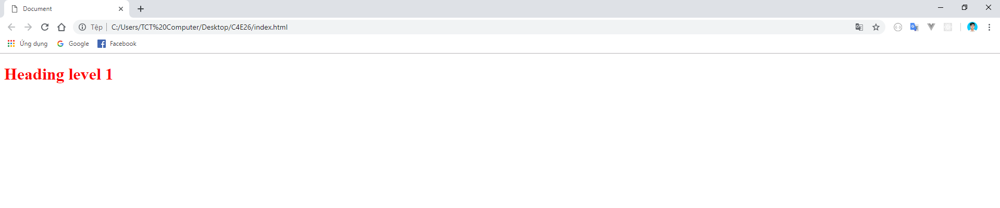
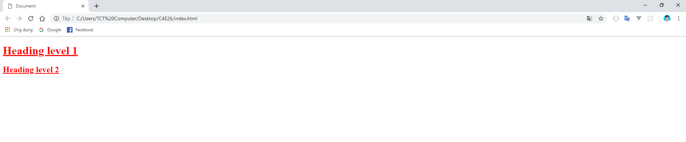
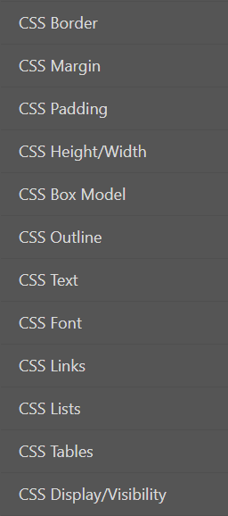

## C4E JS - Student book

### I. CSS LÀ GÌ?
**1. Giới thiệu**
-   Một trang web với cái nhìn ấn tượng, bắt mắt kết hợp với việc sắp xếp các nội dung một cách khoa học sẽ góp phần rất lớn trong việc giữ người dùng ở lại trước khi họ thực sự trải nghiệm các tính năng có trên trang web của bạn.

-   Chính vì vậy, trong chương này chúng ta sẽ tìm hiểu về **CSS**  - một loại "vũ khí" mạnh mẽ giúp chúng ta có thể tùy chỉnh giao diện trang web theo ý muốn.

**2. Khái niệm**
-   **CSS** là viết tắt của Cascading Style Sheet. Hiểu một cách đơn giản, CSS sẽ giúp bạn thay đổi sắp xếp bố cục, thay đổi màu sắc, phông chữ,... của từng thành phần có trên trang web của bạn.

### II. CÚ PHÁP VÀ CÁCH SỬ DỤNG
**1. Chuẩn bị**

-   Để bắt đầu với CSS, bạn hãy tạo một file riêng, nằm cũng bậc với file html. File này có đuôi **.css**:

    

-   Việc cần làm bây giờ là nối file **index.html** và file **style.css** với nhau, sau đó viết các câu lệnh css ở file **style.css** để tác động lên các thẻ html ở file **index.html**:
    -   Ở ngày phía dưới thẻ `<title></title>`, bạn hãy sử dụng **thẻ link**:

        ```html
            <!DOCTYPE html>
            <html lang="en">
            <head>
                <meta charset="UTF-8">
                <title>Document</title>
                <link rel="stylesheet" href="">
            </head>
            <body>

            </body>
            </html> 
        ```
    -   Ở `attribute href` bên trong thẻ link, bạn hãy điền vào đường dẫn đến file `style.css`. Trong trường hợp này, file `style.css` nằm cùng bậc với file `index.html`, vì vậy chỉ cần viết tên file `style.css`:

        ```html
            <link rel="stylesheet" href="style.css">
        ```

**2. Ví dụ**
-   Chúng ta sẽ đi tìm hiểu về cú pháp sử dụng CSS bằng cách đi ngay vào ví dụ:
    -   Ở file html, bạn hãy tạo ra thẻ h1 với nội dung là "Heading Level 1":

        ```html
            <body>
                <h1>Heading level 1</h1>
            </body>
        ```

    -   Mở file `index.html` trên trình duyệt, chúng ta sẽ được dòng chữ "Heading level 1" như sau:

        

    -   Chúng ta sẽ thử **thay đổi màu sắc của chữ thành màu đỏ** và **gạch chân cả dòng chữ**. Sang bên file `style.css` bạn viết như sau:
        ```css
            h1 {
                color: red;
                text-decoration: underline;
            }
        ```

    -   Reload lại trình duyệt, bạn sẽ được kết quả như sau:

        

**3. Cú pháp**

-   Tại sao CSS lại có thể biết chính xác được chúng ta đang muốn tác động và thay đổi thành phần nào trên một file html? Chúng ta sẽ cùng phân tích kỹ cú pháp của CSS ở ví dụ trên:

    ```css
        h1 {
            color: red;
            text-decoration: underline;
        }
    ```
    -   Phần `h1` được gọi là **selector**. Nhờ có **selector**, CSS sẽ biết được người lập trình đang muốn thay đổi thành phần nào của HTML. Cụ thể trong trường hợp trên, **selector** đang được viết dưới dạng tên thẻ, CSS sẽ biết được rằng nó cần phải tác động vào **tất cả các thẻ h1** có mặt trong HTML. Chúng ta sẽ nói kỹ hơn về các dạng còn lại của **selector** thông qua các ví dụ tiếp theo

    -   Bên cạnh **selector** sẽ là cặp ngoặc nhọn, tất cả những gì bạn muốn thay đổi đối với **selector** đã chọn, bạn sẽ đều phải viết ở bên trong cặp ngoặc nhọn.

    -   Phía bên trong cặp ngoặc nhọn, sẽ là các **declaration**. Các **declaration** được ngăn cách nhau bởi dấu chấm phẩy ( ; ). Trong ví dụ trên, **color: red** và **text-decoration: underline** là 2 **declaration**.

    -   Bên trong mỗi **declaration** sẽ bao gồm 2 thứ là **property** và **property value**.

    -   Ảnh dưới đây sẽ cho bạn cái nhìn tổng quan về các khái niệm trên:

        

&rarr; Cũng giống như HTML, CSS rất dễ để tiếp cận và sử dụng, nhưng nắm được hết tất cả các tính năng và công dụng của CSS thì đòi hỏi bạn phải trải qua một quá trình làm việc lâu dài với CSS.

### III. SELECTOR BY CLASS, SELECTOR BY ID
-   Ở ví dụ trên, phần **selector** được viết dưới dạng tên thẻ **(selector by tag name)**. Ngoài dạng trên, **selector** còn rất nhiều dạng khác, trong chương này sẽ chỉ giới thiệu thêm 2 dạng phổ biến nhất của `selector`, đó là viết selector theo **class** và **id** (**selector by class** và **selector by id**).

-   **selector by tag name** thường ít được sử dụng hơn rất nhiều so với **selector by class** và **selector by id**, lý do là vì trong một trang html, một loại thẻ html có thể được sử dụng rất nhiều lần ở nhiều chỗ khác nhau, nên nếu chỉ sử dụng tên thẻ thì sẽ không thể quản lý hết các thẻ html có trong trang web. Vì vậy người ta thường gán cho chúng các attribute như **class** hay **id**, qua đó sử dụng **selector** thông qua những attribute này.

**1. Selector by Class**
-   `selector` viết dưới dạng class thường được sử dụng với mục đích **tái sử dụng**. Cách làm như sau:

    -   Ở bên file html, bạn tạo ra thêm một thẻ `<h2></h2>` với nội dung "Heading level 2":

        ```html
            <body>
                <h1>Heading level 1</h1>
                <h2>Heading level 2</h2>
            </body>
        ```

    -   Thêm cho cả thẻ `<h1></h1>` và thẻ `<h1></h1>` **attribute** `class`, với cùng một `value`:
        ```html
        <body>
            <h1 class="demo-css">Heading level 1</h1>
            <h2 class="demo-css">Heading level 2</h2>
        </body>
        ```
    -   Lần này, thay vì **thay đổi màu sắc của chữ thành màu đỏ** và **gạch chân cả dòng chữ** của `thẻ h1`, chúng ta sẽ áp dụng cho cả 2 thẻ h1 và h2 chỉ với **một lần viết code css**. Ở bên file css bạn viết như sau:

        ```css
            .demo-css {
                color: red;
                text-decoration: underline;
            }
        ```

    -   Với cách viết `selector` như trên, CSS đang hiểu rằng bạn muốn áp dụng những **declaration** bên trong cho **tất cả các thẻ mang class tên là `demo-css`**. Lý do CSS có thể hiểu được **demo-css** là **tên class** chứ không phải **tên thẻ** là nhờ vào **dấu chấm đằng trước**. Chúng ta được kết quả như sau:

        

&rarr; Như vậy, với cách sử dụng class như trên, sau này khi bạn muốn bất kỳ một thẻ html nào **thay đổi màu sắc của chữ thành màu đỏ** và **gạch chân cả dòng chữ** thì chỉ cần thêm cho thẻ html đó attribute `class="demo-css"`.

**2. Selector by Id**
-   Trong một file HTML của bạn có nhiều hơn 1 thẻ h1, nhưng bạn chỉ muốn thay đổi style của một thẻ h1, thì đây là lúc bạn cần phải viết `selector` dưới dạng id:

    -   Ở file html, bạn tạo ra 2 thẻ h1:
        ```html
            <body>
                <h1>Heading level 1</h1>
                <h1>Heading level 1 Again</h1>
            </body>
        ```

    -   Lần này, chúng ta sẽ chỉ muốn **thay đổi màu sắc của chữ thành màu đỏ** và **gạch chân cả dòng chữ** cho thẻ h1 nằm phía dưới. Bạn thêm cho thẻ h1 phía dưới một **attribute** `id` với value là "only":
        ```html
            <body>
                <h1>Heading level 1</h1>
                <h1 id="only">Heading level 1 Again</h1>
            </body>
        ```
    -   Ở bên file css, chúng ta làm tương tự như khi viết selector dưới dạng class:

        ```css
            #only {
                color: red;
                text-decoration: underline;
            }
        ```
    -   Cách hiểu cũng tương tự như khi viết selector dưới dạng class: áp dụng những **declaration** bên trong cho **thẻ nào mang id là `only`**.

&rarr; Trong cả một trang html, một id chỉ nên dùng cho một thẻ duy nhất.

&rarr; Nếu bạn đang thắc mắc rằng có thể sử dụng id thay cho class hoặc ngược lại không, thì câu trả lời là có. Tuy nhiên bạn tuyệt đối không nên làm vậy, id sinh ra là để làm cho một thẻ html nào đó mang tính **duy nhất**.


### IV. BÀI TẬP

-   Bạn hãy vào [đây](https://www.w3schools.com/css/exercise.asp?filename=exercise_syntax1) và làm những phần CSS sau đây:

    

### V. TỔNG KẾT

-   Trên đây là cú pháp, cách sử dụng CSS và kèm theo một vài property cơ bản nhất. Dần dần dựa vào thời gian cũng như nhu cầu trong trang web thì bạn mới có thể tiếp cận và nắm rõ được tất cả tính năng của CSS.

-   Bên cạnh việc trang trí, thay đổi màu sắc, CSS còn giúp cho người lập trình sắp xếp, phân chia bố cục của các thành phần trong HTML một cách khoa học và đẹp mắt. Một trong những tính năng mạnh mẽ nhất của CSS giúp cho người lập trình dễ dàng bố trí trang web của mình một cách hợp lý là **Flexible Box**. Ở phần sau chúng ta sẽ cùng đi tìm hiểu về tính năng này.

*Bài tiếp theo [CSS - Part 2](./css-part2.md)*