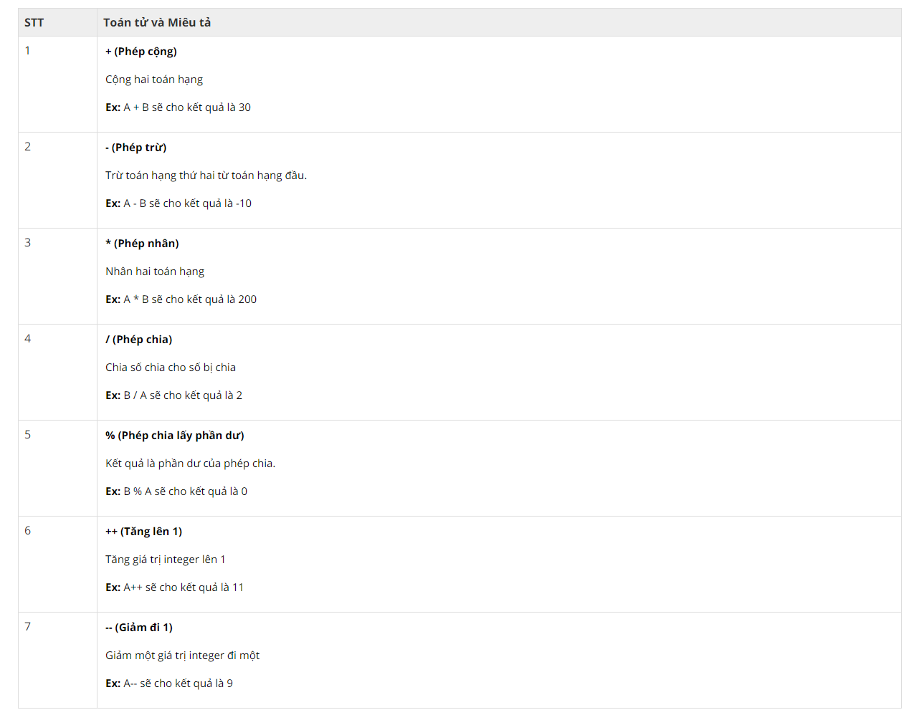
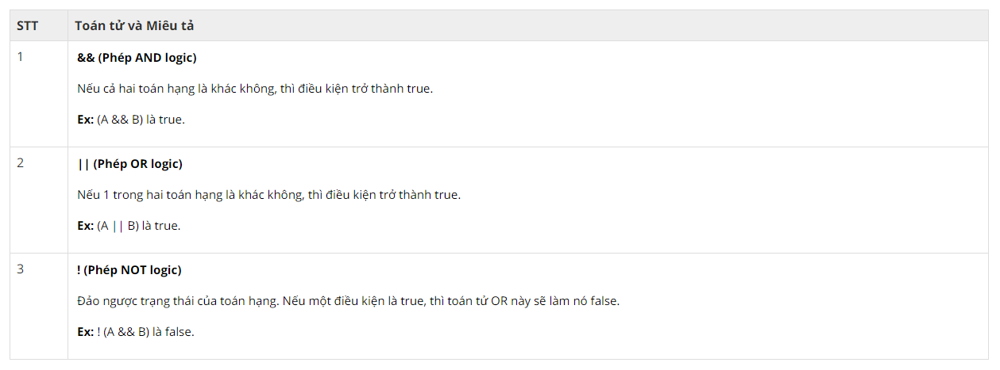

## C4E JS - Student book

### I. KIỂU DỮ LIỆU LÀ GÌ? (DATA TYPES)
**1. Ví dụ thực tế**

-   Hãy tưởng tượng một ngày đẹp trời bạn nổi hứng muốn làm bánh gato tặng người yêu. Điều quan trọng nhất bạn phải có trước khi bắt tay vào làm bánh, đó chính là nguyên liệu.


-   Để làm được một chiếc bánh gato hoàn chỉnh thì sẽ phải cần rất nhiều nguyên liệu, trong ví dụ này sẽ chỉ nói đến 2 loại nguyên liệu cơ bản nhất xuất hiện trong tất cả các loại bánh gato. Đó là **bơ** và **trứng**. Vấn đề bây giờ của bạn là không biết dùng chúng như thế nào và có tác dụng gì. Sau một hồi tìm hiểu, bạn nhận ra **bơ** có tác dụng làm cho bánh thơm hơn, còn **trứng** sẽ khiến chiếc bánh tơi xốp hơn.

-   Trong ví dụ trên, có thể coi **bơ** và **trứng** là 2 **Kiểu Dữ Liệu** khác nhau, dùng với 2 mục đích khác nhau, mặc dù cùng góp sức tạo nên chiếc bánh.

**2. Khái niệm**  

-   Chỉ có các loại số (number) thì mới có thể sử dụng để tính toán, còn văn bản chữ và các loại ký tự thì không. Bản thân máy tính không thể phân biệt được đâu là chữ và đâu là số. Vậy nên tất cả các ngôn ngữ lập trình đều sẽ có một vài quy tắc để phân biệt chúng, JavaScript cũng không ngoại lệ. Nắm được các quy tắc này, bạn sẽ dễ dàng thao tác và xử lý được với mọi loại dữ liệu.

-   Trong ngôn ngữ lập trình nói chung và JavaScript nói riêng, mỗi một biến (variable) sẽ mang một giá trị (value), và mỗi một value này sẽ mang một kiểu dữ liệu (data types).

*Ví dụ*:  
Trong đoạn lệnh sau:
``` javascript
    let x = 100;
    let y = "100";
```
-   x và y đều mang giá trị là 100, nhưng giá trị 100 của x là **số(number)**, còn giá trị "100" của y là **chuỗi(string)**.

-   Có thể thấy, giá trị của x và y nhìn qua thì có vẻ giống nhau, nhưng lúc thì là **number**, lúc lại là **string**. Việc nắm rõ cách sử dụng và phân biệt được các kiểu dữ liệu là hết sức quan trọng, nhầm lẫn có thể dẫn đến những kết quả không như mong đợi.

-   Trong JavaScript có tất cả 7 kiểu dữ liệu:
    -   string
    -   number
    -   boolean
    -   null
    -   object
    -   undefined
    -   array  
Trong chương này sẽ chỉ đề cập đến một số kiểu dữ liệu quan trọng nhất, người lập trình sẽ gặp phải nhiều nhất trong một dự án, đó là **String** và **Number**. Các kiểu dữ liệu còn lại sẽ được đề cập trong các chương sau.

### II. CHI TIẾT CÁC KIỂU DỮ LIỆU
**1. String**
-   Dữ liệu thuộc kiểu **String** là một chuỗi các ký tự được bọc trong dấu **quotes**. 
-   Một dữ liệu bất kỳ (kể cả số), khi được bọc trong **quotes** sẽ đều tính là **String**. Như vậy, nếu **Số** khi được bọc vào **quotes** sẽ không thể sử dụng để tính toán. Ví dụ:  
    ``` javascript
        let x = "1";
        let y = "2";
        console.log(x + y) // 12

        // Kết quả ra 12 vì x và y đều là dữ liệu thuộc kiểu String, nên phép cộng là hành động nối String, không phải là phép cộng trong toán học.
    ```

-   Trong JavaScript, có 3 loại **quotes**:
    -   Dấu nháy kép (Double quotes): 
        ``` javascript"TechKids"```
    -   Dấu nháy đơn (Single quotes):
        ``` javascript'TechKids'```
    -   Backticks:
        ``` javascript`TechKids````
-   Cả 3 loại **quotes** trên đều là dấu hiệu đánh dấu kiểu dữ liệu đang là **String**. Tuy nhiên **Backticks** đặc biệt hơn so với 2 loại còn lại:
    -   Backticks cho phép chèn biến hoặc biểu thức vào giữa **String** bằng cách gói các biến hoặc biểu thức đó vào trong **${}**. Ví dụ:  
    ``` javascript
        let name = "Quan";
        console.log(`Hello, ${name}!`) // Hello, Quan!
    ```
    ``` javascript
        console.log(`I was born in 1996, so I am ${2018 - 1996} years old.`) // I was born in 1996, so I am 22 years old.
    ```

    <i>**Bài tập**</i>  
    Kết quả sẽ như thế nào sau khi chạy đoạn code dưới đây?
    -   Code 1
        ``` javascript
            let myFeel = "happy";
            console.log("I feel ${myFeel}");
        ```
        *[Đáp án](result-1.md)*

    -   Code 2
        ``` javascript
            let x = "10 is greater than ";
            let y = "5";
            console.log(x+y)
        ```
        *[Đáp án](result-2.md)*

    -   Code 3
        ``` javascript
            console.log(`Result of 1+2 is ${1+2}`)
        ```
        *[Đáp án](result-3.md)*

    
**2. Number**
-   Kiểu dữ liệu **Number** biểu diễn các dữ liệu thuộc dạng **Số**, bao gồm cả số nguyên (integer) và số thực (float), có thể chứa dấu (-) để biểu thị số âm. 

-   Ví dụ:  
    ``` javascript
        let myAge = 22;
    ```

-   Nhắc lại một chút, một số được đặt bên trong **quotes** thì sẽ tính là **String**, không thể sử dụng để tính toán.  

    <i>**Bài tập**</i>  
    Kết quả sẽ như thế nào sau khi chạy đoạn code dưới đây?
    ``` javascript
        let x = 5;
        let y = "10";
        console.log(x+y);
    ```
    *[Đáp án](result-4.md)*

-   Nhắc đến **Number** thì sẽ không thể thiếu các loại toán tử (operators). Trong JavaScript chia làm rất nhiều các loại toán tử khác nhau, trong chương này sẽ chỉ đề cập đến một số loại toán tử sử dụng thường xuyên nhất. Các loại toán tử trong chương này bao gồm:

    -   **Toán tử số học (Arithmetic Operators)**:  
        Giả sử có A = 10, B = 20, bảng dưới đây sẽ mô tả và giải thích rõ ràng ý nghĩa của các loại toán tử số học

          
        (*Nguồn: https://www.vietjack.com*)


    -   **Toán tử so sánh (Comparison Operators)**  
        Giả sử có A = 10, B = 20, bảng dưới đây sẽ mô tả và giải thích rõ ràng ý nghĩa của các loại toán tử so sánh

          
        (*Nguồn: https://www.vietjack.com*)

    -   **Toán tử Logic (Logical Operators)**
        Giả sử có A = 10, B = 20, bảng dưới đây sẽ mô tả và giải thích rõ ràng ý nghĩa của các loại toán tử logic  

          
        (*Nguồn: https://www.vietjack.com*)

    -   **Toán tử typeof (The typeof Operator)**  
        
        Toán tử typeof sẽ giúp bạn kiểm tra **kiểu dữ liệu** của một **dữ liệu** bất kỳ, cách sử dụng như sau:
        ``` javascript
            typeof "John"                 // Returns string 
            typeof 3.14                   // Returns number
            typeof NaN                    // Returns number
            typeof false                  // Returns boolean
            typeof [1, 2, 3, 4]           // Returns object
            typeof {name:'John', age:34}  // Returns object
            typeof new Date()             // Returns object
            typeof function () {}         // Returns function
            typeof myCar                  // Returns undefined (if myCar is not declared)
            typeof null                   // Returns object
        ```  
        (*Nguồn: https://www.w3schools.com*)
        
        Trong ví dụ trên bạn sẽ thấy một vài kiểu dữ liệu mới lạ, nhưng **đừng lo lắng**, những kiểu dữ liệu này sẽ được đề cập tới ở các chương sau.

**3. Bài tập**  

-   Trước khi làm bài tập, bạn hãy làm quen với câu lệnh input (nhận dữ liệu nhập vào từ bàn phím) cú pháp như sau:

    ``` javascript
        promt("Your message")
    ```

-   Trong câu lệnh trên, phần **string** ở bên trong cặp ngoặc tròn là yêu cầu mà bạn muốn người dùng nhập vào. Ví dụ:

    ``` javascript
        let school = prompt("What's your school?")
        console.log(school)
    ```  

      

-   Khi chạy code, sẽ xuất hiện một cửa sổ để bạn nhập dữ liệu từ bàn phím và ấn OK. Sau đó những gì bạn nhập sẽ được lưu vào biến **school**, bạn có thể in nó ra màn hình để dễ nhìn.

**Bài tập 1**  

-   Viết chương trình cho phép người dùng nhập vào tên, tuổi. Sau đó in ra màn hình đoạn text theo cú pháp "<Tên> is <Tuổi> years old!"

-   Ví dụ người dùng nhập vào **Quân** và **22**, màn hình sẽ in ra **"Quân is 22 years old!"**

**Bài tập 2**  

-   Cũng chương trình như ở bài tập 1, nhưng lần này hãy cho phép người dùng nhập vào tên và tuổi của 5 người khác nhau. Sau đó in ra màn hình thông tin của 5 người đó theo đúng cú pháp như bài tập 1.

*Bài tiếp theo [Vòng lặp (Loops)](../loops/loops.md)*
    


