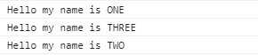
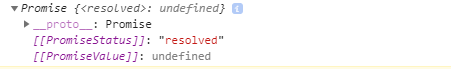
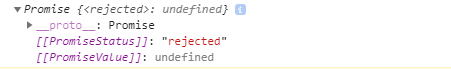

## C4E JS - Student book

### I. HÀM PROMISE (PROMISE FUNCTION)

**1. Giới thiệu cơ chế bất đồng bộ (async)**
-   Trước khi đi tìm hiểu về một trong những khái niệm tương đối phức tạp này, chúng ta cần phải nắm được cơ chế hoạt động **bất đồng bộ (async)** của JavaScript.

-   **Bất đồng bộ (Async)** là đặc thù của JS, bạn có thể hiểu đơn giản là JS chạy code **không chờ đợi**. Ví dụ sau đây sẽ giúp bạn hiểu hơn về cơ chế này:

    ``` javascript
        console.log("Hello my name is ONE");
        console.log("Hello my name is TWO");
        console.log("Hello my name is THREE");
    ```

-   Chạy đoạn code trên bạn sẽ thấy code được thực hiện lần lượt từ trên xuống dưới:  

    

-   Sửa lại ví dụ trên một chút như sau:  
    ``` javascript
        console.log("Hello my name is ONE");

        setTimeout(function(){
            console.log("Hello my name is TWO");
        }, 3000);
        
        console.log("Hello my name is THREE");
    ```

-   Phần code bao ngoài câu lệnh **console.log("Hello my name is TWO");** bạn có thể tạm hiểu như sau: *ra lệnh cho JS **sau 3000 milisecond (tương đương 3 second) thì mới được in ra đoạn text "Hello my name is TWO"***. (Tham khảo thêm: https://www.w3schools.com/jsref/met_win_settimeout.asp)

-   Kết quả:  


&rarr; Bạn hãy để ý đến dòng lệnh console.log() cuối cùng. Thay vì phải chờ đợi 3 giây để **"Hello my name is TWO"** được in ra màn hình rồi nó mới chạy, thì nó đã chạy ngay và cho ra kết quả trước khi **"Hello my name is TWO"** được in ra. Lý do là vì thời gian thực hiện của nó nhanh hơn. Cơ chế hoạt động này được gọi là **bất đồng bộ**

&rarr; Cơ chế **bất đồng bộ** tóm gọn lại như sau:
-   Tất cả các dòng lệnh, chức năng được chạy đồng thời. Dòng lệnh, chức năng nào nhanh hơn thì sẽ thực thi xong trước.

-   Nếu 2 dòng lệnh, chức năng cùng tốc độ, thì sẽ ưu tiên theo thứ tự từ trên xuống dưới.

***Nhận xét:*** JavaScript hoạt động với cơ chế bất đồng bộ như trên, vậy làm thế nào để quản lý tốt kết quả của một hành động bất đồng bộ (Async)? **Promise** sẽ giúp chúng ta làm điều này.

**2. Khái niệm Promise**

-   **Promise** là một phương pháp giúp xử lý vấn đề bất đồng bộ hiệu quả hơn.

-   Khi đứng trước một hành động cụ thể, **Promise** sẽ giúp chúng ta trả lời được 2 câu hỏi: 
    -   "Nếu hành động thành công thì làm gì?
    
    -   "Nếu hành động thất bại thì làm gì?"

-   Ví dụ: Xử lý hành động load ảnh lên trang web, nếu thành công thì ảnh sẽ được load lên, nếu thất bại thì sẽ thay thế bằng thông báo lỗi hoặc một bức ảnh mặc định. **Promise** giúp chúng ta quản lý việc này.

**3. Cú pháp**

-   Cú pháp để khởi tạo một **Promise** như sau:
    ``` javascript
        let myPromise = new Promise();
    ```
-   Ở bên trong cặp ngoặc đơn sẽ là một **function với 2 parameter**. 2 parameter này sẽ được giải thích ở phần sau.
    ```javascript
        let myPromise = new Promise(function(resolve, reject){
            
        });
    ```

**4. Trạng thái của Promise (Promise status)**
-   Mỗi khi một **Promise** được tạo ra, sẽ luôn có 3 trạng thái như sau:
    -   **Pending**: là trạng thái mặc định ban đầu của **Promise** khi mới được khởi tạo và chưa làm gì.
    ```javascript
        let myPromise = new Promise(function(resolve, reject){

        });

        console.log(myPromise);
    ```
      


    -   **Resolved (hoặc Fulfilled)**: là trạng thái của Promise đã thành công, khi sử dụng **resolve**.
     ```javascript
        let myPromise = new Promise(function(resolve, reject){
            resolve();
        });

        console.log(myPromise);
    ```
     

    -   **Rejected**: là trạng thái của Promise thất bại, khi sử dụng **reject**. Khi bạn sử dụng reject thì bắt buộc phải khai báo hành động xử lý cho nó (tức sử dụng then hoặc catch). ***Sẽ được giải thích chi tiết ở phần sau.***
     ```javascript
        let myPromise = new Promise(function(resolve, reject){
            reject();
        });
        
        myPromise.catch(function() {
            // something
        });

        console.log(myPromise);
    ```
     

&rarr; 3 trạng thái trên của một **Promise** bạn không cần phải cố gắng ghi nhớ ngay, thực hành nhiều tự khắc bạn sẽ phân biệt được chúng.

&rarr; Có một ví dụ như sau để bạn có thể có cái nhìn tổng quan hơn về 3 trạng thái trên của Promise:
    
-   Trước hết, đúng như tên gọi, **Promise** là **lời hứa**, khi **khởi tạo một Promise**, có thể coi là tôi hứa sẽ tặng bạn một món quà. (Nhớ là tôi chỉ hứa thôi nhé, tôi chưa tặng)

-   Khi **sử dụng resolve**, nghĩa là lời hứa của tôi đã được thực hiện, và thành công, tôi tặng bạn quà rồi.

-   Khi **sử dụng reject**, nghĩa là lời hứa của tôi đã được thực hiện, và thất bại, tôi không tặng bạn quà nữa.

-   Vậy khi lời hứa của tôi được thực hiện (thành công hoặc thất bại), bạn sẽ xử lý chúng thế nào? Hãy đi tiếp xuống phần bên dưới để cùng tìm hiểu.

### II. THENABLE và CATCH
**Thenable** và **Catch** là 2 đoạn lệnh xuất hiện cùng Promise, **chỉ có thể gọi được khi đã khai báo Promise**

**1. Thenable**
-   **Thenable** là một đoạn code ghi nhận kết quả thực hiện hành động của **Promise** (thành công hoặc thất bại), cú pháp như sau:

    ``` javascript
        let myPromise = new Promise(function(resolve, reject){

        })

        myPromise.then(
            function(success) {
                // code when Promise resolve
            },

            function(error) {
                // code when Promise reject
            }
        )
    ```

-   Bên trong **.then()** sẽ là 2 function:
    -   Function thứ nhất thực hiện xử lý khi Promise sử dụng **resolve**. 

    -   Function thứ hai thực hiện xử lý khi Promise sử dụng **reject**. 

    -   Nếu trong .then() chỉ có một function, thì function đó sẽ được JS hiểu là xử lý khi Promise sử dụng **resolve**. 

    &rarr; Để viết những đoạn code xử lý khi Promise sử dụng **reject**, bạn buộc phải viết ra cả 2 function. 

-   Ví dụ:

    1.  
    ``` javascript
        let myPromise = new Promise(function(resolve, reject){
            resolve();
        })

        myPromise.then(
            function(success) {
                console.log("Success");
                // code when Promise resolve
            }
        )
    ```
    
    -   Màn hình sẽ in ra dòng "Success", vì lệnh **console.log("Success");** nằm trong function đầu tiên của **.then()** - nơi xử lý khi **Promise resolve**.

    2.  
    ``` javascript
        let myPromise = new Promise(function(resolve, reject){
            reject();
        })

        myPromise.then(
            function(success) {
                console.log("Success");
                // code when Promise resolve
            },

            function(error) {
                console.log("Error");
                // code when Promise reject
            }
        )
    ```

    -   Màn hình sẽ in ra dòng "Error", vì lệnh **console.log("Error");** nằm trong function thứ 2 của **.then()** - nơi xử lý khi **Promise reject**.

    ***Nhắc lại***: Để viết những đoạn code xử lý khi Promise sử dụng **reject**, bạn buộc phải viết ra cả 2 function bên trong **.then()**. 

-   Trong các ví dụ trên, bạn hoàn toàn có thể làm như sau:
    ``` javascript
        let myPromise = new Promise(function(resolve, reject){
            resolve("Success");
        })

        myPromise.then(
            function(success) {
                console.log(success);
                // code when Promise resolve
            }
        )
    ```
    -   Truyền cho **resolve** một giá trị, giá trị đó sẽ được parameter **success** của function trong **.then()** nhận (Ví dụ bên dưới có thể làm tương tự).

***Lưu ý:*** Nếu cả **resolve()** và **reject()** cùng được sử dụng, thì cái nào được gọi trước thì cái đó sẽ có tác dụng.

&rarr; Hoặc **resolve()**, hoặc **reject()**.

**2. Catch**
-   Có một cách khác có tác dụng tương tự việc viết function thứ 2 trong .then() (**function thực hiện khi Promise reject**), đó là **.catch()**. Cú pháp:

``` javascript
        let myPromise = new Promise(function(resolve, reject){
            reject();
        })

        myPromise
            .then(
                function(success) {
                    console.log("Success");
                    // code when Promise resolve
                }
            )
            .catch(function(message) {
                console.log("Error");
                // code when Promise reject
            })
```
-   Chạy đoạn code trên, bạn sẽ thấy kết quả cũng giống như việc viết ra function thứ 2 của .then()

&rarr; Nếu vừa **sử dụng function thứ 2 của .then()**, vừa **sử dụng .catch()** thì chuyện gì sẽ xảy ra? Câu trả lời là **function thứ 2 của .then()** sẽ được chạy, **.catch()** thì không. Ví dụ:

``` javascript
        let myPromise = new Promise(function(resolve, reject){
            reject();
        })

        myPromise
            .then(
                function(success) {
                    console.log("Success");
                    // code when Promise resolve
                }, 

                function(error) {
                    console.log("Error")
                // code when Promise reject

                }
            )
            .catch(function(error) {
                console.log("Catch Error")
                // code when Promise reject, but doesn't work!
            })
```

-   Chạy đoạn code trên, bạn sẽ thấy kết quả in ra màn hình chữ "Error", nằm trong **function thứ 2 của .then()**

### III. TỔNG KẾT
-   Trong các chương tiếp theo, chúng ta sẽ thực sự bước chân vào thế giới web.

-   **Promise** sẽ áp dụng rất nhiều khi chúng ta làm việc với dữ liệu và mạng để hiển thị và bố trí sắp xếp dữ liệu lên web. 

*Bài tiếp theo [HTML](../html/html.md)*
