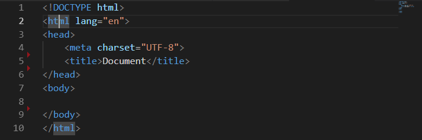
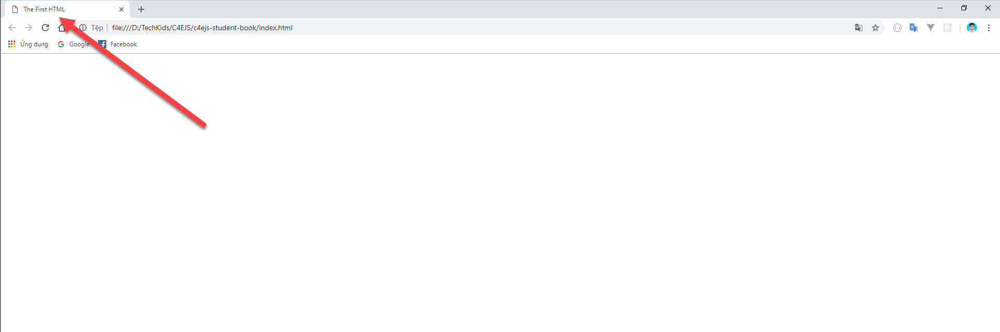
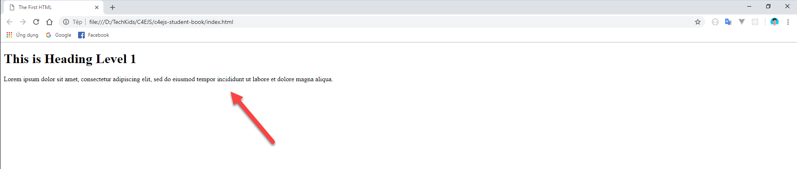
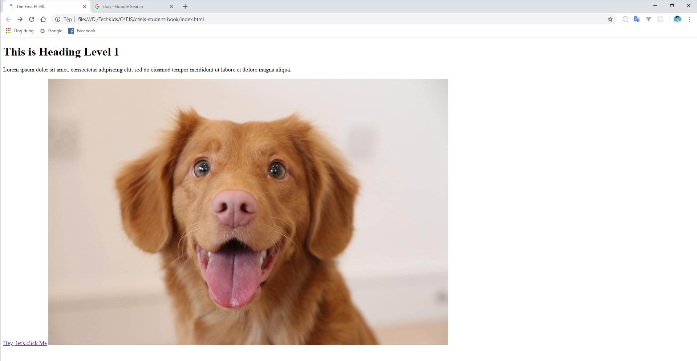
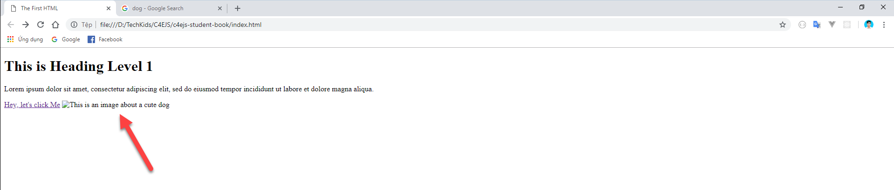

## C4E JS - Student book

### I. HTML là gì?
**1. Giới thiệu**
-   Nếu bạn đã quên mất HTML có liên quan thế nào đến JavaScript, thì bạn hãy quay lại chương đầu tiên [Giới thiệu khoá học (Introduction)](course_introduction.md) để nhớ lại thông qua ví dụ trực quan, trước khi đến với những khái niệm dưới đây

**2. Khái niệm**

-   **HTML** là chữ viết tắt của cụm từ **H**yper **T**ext **M**arkup **L**anguage (Ngôn ngữ đánh dấu siêu văn bản).

-   Tất cả những nội dung hiển thị trên một trang web bất kỳ, đều được thể hiện qua **HTML**.

### II. CÚ PHÁP
Cách tạo một file html đã được nói trong chương đầu tiên của khóa học. Trong chương này chúng ta sẽ đi ngay vào các khái niệm cần thiết của HTML.

**1. Thẻ (Tag hoặc Element)**
-   Mỗi một nội dung bất kỳ được khai báo ra để hiển thị trên trang web đều được bọc trong một **cặp thẻ (tags)**.

-   Một cặp thẻ được viết ra như sau:
    ``` html
        <h1>This is Heading Level 1</h1>
    ```
    **h1** được gọi là tên của thẻ. **Thẻ h1** Bao gồm 3 phần:
    -   `<h1>`: Thẻ mở (Openning tag)
    -   `</h1>`: Thẻ đóng (Openning tag)
    -   `This is Heading Level 1`: Nội dung của thẻ (text). Đây là phần mà người sử dụng trang web sẽ nhìn thấy

**2. Cấu trúc của 1 file html**
-   Bạn hãy nhìn tổng thể bộ khung html được dựng sẵn (đã hướng dẫn ở chương đầu), chúng ta sẽ cùng tìm hiểu bộ khung này bao gồm những gì.

    ``` html
        <!DOCTYPE html>
    ```
    &rarr; Nhìn qua thì có vẻ giống 1 thẻ HTML, nhưng thực chất đây không phải là 1 thẻ. **!DOCTYPE** chỉ cho trình duyệt web biết được phiên bản ngôn ngữ được sử dụng trong trang web (ở đây là html 5).

-   Tiếp đến là **thẻ html**, đây là thẻ bao lấy toàn bộ nội dung của cả file html, bạn có thể click vào tên của thẻ, sẽ thấy thẻ mở và thẻ đóng sáng lên. (Bạn hãy xóa đi những phần không cần thiết, để gọn gàng như hình dưới)

     

    ``` html
        <html lang="en">

        </html>
    ```
    -   `lang="en"`: đây được gọi là **attribute** của thẻ, bên trái dấu bằng là **tên của attribute**, bên phải dấu bằng là **giá trị của attribute**.

    -   `lang="en"` có tác dụng khai báo ngôn ngữ cho một trang web, mục đích dùng để hỗ trợ cho trình duyệt và công cụ tìm kiếm.

-   Bên trong thẻ html chia làm 2 phần: **head** và **body**:
    -   **Thẻ head** được sử dụng để chứa tiêu đề và những khai báo ban đầu của trang web cho trình duyệt biết, thông qua thẻ **meta** và thẻ **title**:
        ```html
            <html lang="en">
                <meta charset="UTF-8">
                <title>Document</title>
            </html>
        ```
        -   `<meta charset="UTF-8">`: đây là thẻ đặc biệt, không có **thẻ đóng (Closing tag)**. Thẻ này có tác dụng khai báo cho trình duyệt biết trang web sử dụng chuẩn **UTF-8**. Bạn có thể tìm hiểu thêm về chuẩn UTF-8 tại [đây](https://vi.wikipedia.org/wiki/UTF-8)

        -   `<title>Document</title>`: Hãy thử thay đổi phần **text** nằm giữa cặp thẻ, sau đó mở file html trên trình duyệt:
        ```html
            <title>The First HTML</title>
        ```
         

        &rarr; Nội dung của thẻ title sẽ quyết định tiêu đề của trang web.

    -   **Thẻ body** sẽ là nơi chứa toàn bộ nội dung hiển thị của trang web. Bạn hãy thử viết một nội dung bất kỳ bên trong thẻ body:
    ```html
        <body>
            Hello, this is my first html file
        </body>
    ```
     
    
***Lưu ý:*** Vì thẻ body là nơi chứa **toàn bộ nội dung hiển thị trên trang web**, nên các nội dung được giới thiệu ở phía dưới đây đều được viết **bên trong cặp thẻ body**

### III. CÁC THẺ CƠ BẢN
HTML khá dễ để tiếp cận, nhưng để nắm được hết tất cả các tính năng, các thẻ của HTML thì không thể trong một sớm một chiều được, và thẻ nào được sử dụng cũng sẽ tùy vào từng trường hợp cụ thể. Vì vậy trong chương này sẽ chỉ giới thiệu một vài thẻ phổ biến nhất, xuất hiện trong hầu hết các trang web


**1. Thẻ heading**
-   **Thẻ heading** thường được sử dụng để hiển thị các tiêu đề bài viết.
    ```html
        <h1>This is Heading Level 1</h1>
    ```
     

-   Thẻ heading bao gồm 6 level, từ `<h1></h1>` cho đến `<h6></h6>`. **Thẻ h1** có cỡ chữ to và đậm nhất, giảm dần cho đến **thẻ h6**.

**2. Thẻ paragraph**
-   **Thẻ paragraph (thẻ p)** được sử dụng cho những đoạn văn bản, nội dung bài viết.
    ```html
        <p>Lorem ipsum dolor sit amet, consectetur adipiscing elit, sed do eiusmod tempor incididunt ut labore et dolore magna aliqua.</p>
    ```
     

**3. Thẻ anchor**
-   **Thẻ anchor (thẻ a)** được sử dụng để tạo một dòng text có thể click được, khi click vào sẽ đưa người dùng đến một địa chỉ web.
    ```html
        <a href="https://www.google.com/">Hey, let's click Me</a>
    ```
-   **Thẻ a** có một **attribute** là **href**, **attribute** này mang giá trị là `https://www.google.com/`.

    *Tất cả các attribute đều được viết bên trong thẻ mở (Openning tag)*

-   `Hey, let's click Me` là nội dung mà người sử dụng web có thể nhìn thấy và bấm vào được. Khi người dùng bấm vào thì sẽ được đưa đến trang web viết trong **attribute href** (`https://www.google.com/`)

     

-   Khi bấm vào, bạn sẽ được chuyển đến trang Google, đè mất lên trang của bạn. Hãy thêm **attribute target** với giá trị là dấu **#** như sau để khi người dùng bấm, trang Google sẽ được mở ở một tab khác trên trình duyệt
    ```html
        <a href="https://www.google.com/" target="#">Hey, let's click Me</a>
    ```

**4. Thẻ image**
-   **Thẻ image (thẻ img)** được sử dụng để hiển thị nội dung là ảnh.
 ```html
    
```
-   **Thẻ img** là một thẻ đặc biệt, không có thẻ đóng (Closing tag)

-   **Thẻ img** có 2 **attribute** là **src** và **alt**:
    -   Phần giá trị trong **Attribute src** sẽ là link hoặc đường dẫn của bức ảnh mà bạn muốn hiển thị. Ở đây mình sẽ lấy một link ảnh online:
    ```html
        
    ```
     

    -   Phần giá trị trong **Attribute alt** sẽ có tác dụng khi ảnh của bạn không thể load được, có thể là do link ảnh sai, hoặc do mạng không ổn định.
    ```html
        
    ```
     
    
    &rarr; đoạn code trên đã cố tình làm cho link bức ảnh bị sai, bằng cách xóa đi phần `.jpg`, như vậy đoạn text trong **attribute alt** sẽ phát huy tác dụng.

### IV. BÀI TẬP

1.  Bạn hãy vào [đây](https://www.w3schools.com/html/exercise.asp) và làm lần lượt các bài tập trong các mục **Attributes**, **Headings**, **Paragraph**, **Link**, **Image**

2.  Bạn hãy tải file [này](https://drive.google.com/file/d/1kBsNjZB4eX7AkJc2TufI_pOymdK_Xmb5/view) về, mở file `Article-HTML-Only.pdf` ở trong "to-student". Nhiệm vụ của bạn là sử dụng HTML để tạo ra một trang giống như vậy. Bên cạnh file `Article-HTML-Only.pdf`, bạn sẽ tìm thấy những tấm ảnh cần thiết để hoàn thành theo mẫu.

*Bài tiếp theo [DOM Manipulations](../dom/dom-manipulations.md)*


