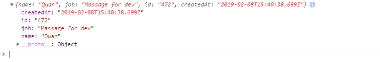

## C4E JS - Student book

### I. NETWORKING LÀ GÌ?
**1. Giới thiệu**

-   Nhắc đến web thì không thể không nhắc đến mạng internet. Tất cả những gì chúng ta học từ đầu khóa đến giờ đều là những phần không liên quan gì tới mạng.

-   Một trang web thường sẽ hoạt động dựa trên mô hình **Client - Server**:
    -   **Client** hiểu đơn giản là trình duyệt web của bạn.
    -   **Server** có thể hiểu là một chiếc máy tính lớn với cấu hình đặc biệt để có thể lưu trữ và vận hành tốt toàn bộ dữ liệu của trang web.

-   Trong khóa học này, chúng ta sẽ sử dụng JavaScript để phát triển trang web từ phía **Client** trước. Với vai trò là một người lập trình để phát triển trang web, tất cả những thao tác, xử lý có sử dụng internet vượt ra khỏi phạm vi máy tính (Browser hoặc Client) của bạn, được gọi chung là **Networking**.

### II. VÍ DỤ THỰC TẾ

-   Về cơ bản thì **Client** và **Server** sẽ giao tiếp với nhau thông qua **các giao thức (HTTP methods)**, trong chương này chúng ta sẽ làm quen với một trong các giao thức được sử dụng nhiều nhất là **GET**

-   Để có một cái nhìn tổng quát, chúng ta sẽ sử dụng ví dụ chung sau đây:

    -   Giả sử bạn đang đói và quyết định đi đến cửa hàng bành mỳ để mua bánh mỳ. Lúc này sẽ xuất hiện cuộc trò chuyện giữa bạn và cô bán bánh mỳ (cô này tên là Mrs.Bread).

    -   Bạn sẽ đóng vai trò là **Client**, Mrs.Bread là **Server**.

    -   Quy trình mua bánh mỳ như sau:

        ***B1***: Bạn yêu cầu Mrs.Bread đưa cho bạn loại bánh mỳ ngon nhất.

        ***B2***: Bạn nhận bánh mỳ từ Mrs.Bread.

    -   Sau khi Mrs.Bread đưa bánh ra ra và bạn cầm lấy bánh trên tay rồi, tức là bạn đã **lấy** (**GET**) bánh mỳ từ Mrs.Bread thành công.

-   Ở ví dụ trên, coi bánh mỳ bạn nhận được là **dữ liệu**.

-   Đối chiếu với ví dụ trên, **GET** bao gồm 2 bước:
    -   Gửi yêu cầu **GET**
    -   Nhận dữ liệu

-   Bạn chỉ cần quan tâm đến bước đầu tiên, tức là làm sao để có thể **gửi yêu cầu GET** (**send GET request**). Còn **nhận dữ liệu** là hệ quả sau khi việc **GET request** được thực hiện thành công.

### III. CÚ PHÁP

-   Trong phần này, chúng ta sẽ thử thực hiện một **GET request** tới một **server** có sẵn (server này chứa thông tin của một vài user nào đó), mục đích cuối cùng sẽ là lấy về được thông tin của các user này.

-   Cú pháp thực hiện việc gửi **GET request** như sau:
    -   Tạo một function tên là getUsers
        ```js
        function getUsers(){
            
        }
        ```

    -   Chuẩn bị một link API, ví dụ: `https://reqres.in/api/users`
    
        (Nguồn: https://reqres.in) 
        
        (khóa học này không tập trung quá nhiều vào định nghĩa API, mà chỉ tập trung vào cách làm việc với nó, nên bạn có thể tạm hiểu API là một link chứa dữ liệu. Bạn có thể tìm kiếm các link API chứa data có sẵn trên mạng)

    -   Sử dụng function **fetch()** có sẵn của JavaScript để **GET** dữ liệu từ API trên và lưu vào biến **response**, sau đó in ra **response** như sau:

        ```js
        function getUsers() {
            const response = fetch('https://reqres.in/api/users');

            console.log(response);
        }       
        ```

    -   Tiếp theo, để đảm bảo function **fetch()** hoàn thành xong nhiệm vụ của nó trước khi in ra màn hình, chúng ta sử dụng **async/await**:

        ```js
        async function getUsers() {
            const response = await fetch('https://reqres.in/api/users');

            console.log(await response.json());
        } 
        ```

    -   Ở dòng in ra màn hình có thêm **.json()** và **await** đằng trước, thì bạn có thể hiểu như sau:
        -   **await** để đảm bảo dòng lệnh in ra chỉ được thực hiện khi **fetch dữ liệu thành công**.
        
        -   **.json()** để lấy ra được dữ liệu thực sự có trong API.

    -   Như vậy là function **getUsers()** đã được hoàn thành. Bây giờ chúng ta chỉ việc gọi **getUsers()**:

        ```js
            getUsers();
        ```
    -   Đến đây là chúng ta đã hoàn thành xong việc lấy dữ liệu từ một API bất kỳ, kết quả như sau:

        

    -   Dữ liệu này hoàn toàn trùng khớp với dữ liệu khi bạn truy cập trực tiếp vào link API trên.

### IV. BÀI TẬP

-   Bên cạnh **GET** thì **POST** cũng là một method được sử dụng thường xuyên trong quá trình phát triển web. Để có thể hình dung được method **POST**, hãy cùng tiếp tục với ví dụ ở phần II:

    -   Sau khi nhận bánh mỳ từ Mrs.Bread, bạn **đồng ý mua**.

    -   **Đồng ý mua** cũng có nghĩa là bạn sẽ phải đưa lại cho Mrs.Bread một số tiền.

    -   Nói cách khác, bạn đang **gửi** (**POST**) cho Mrs.Bread một số tiền tương ứng với chiếc bánh mỳ.

&rarr; Tìm hiểu và thực hiện **POST** dữ liệu có dạng như sau lên API `https://reqres.in/api/users`.

```json
    {
        "name": "Quan",
        "job": "Massage for dev"       
    }
```
-   Kết quả sau khi thực hiện thành công sẽ như sau:
    

-   ***Gợi ý***: Chỉ thực hiện thay đổi function fetch()

*Bài tiếp theo [CSS - Part 1](../css/css-part1.md)*
