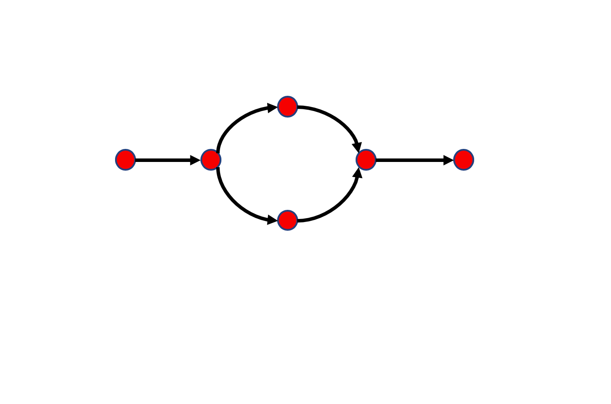
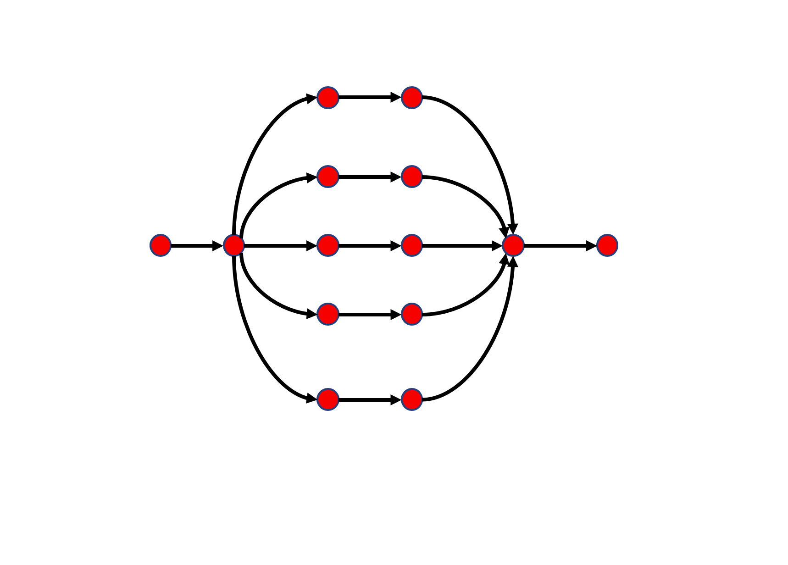
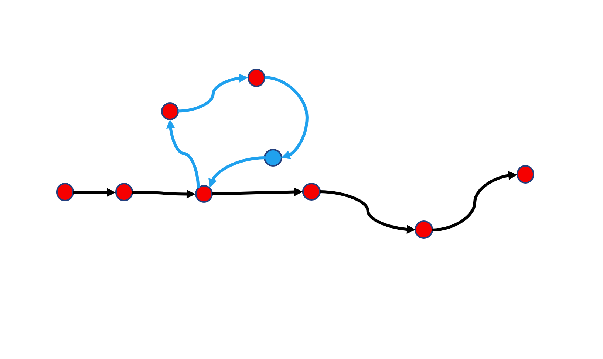

## Control  Flows 
When your program contains statements, expressions , the statements are executed as if they are a story, from top to bottom.
```js
let a = "somebody";
console.log(a);
a = 'Ricardo'
console.log("hello "+a)
// > somebody 
// > hello Ricardo
```
But we can change the way statments executed by using flow control mechanism and conditional expressions.

> ### if 


> ### if - else



> ### switch - case



> ### for and while


> ### do - while



> ### ```break```

When met `break` keyword, runtime engine skips remain parts of loop 

> ### Why ```for``` loop is better?