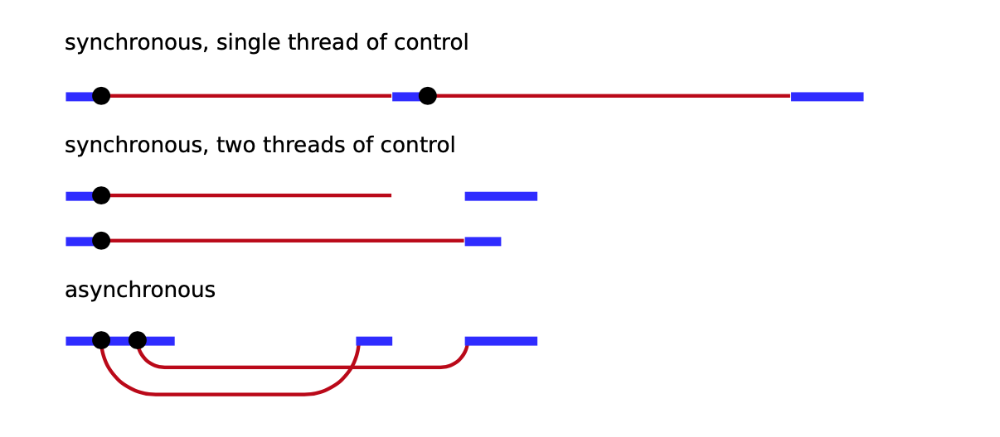

## Asynchronous 


> ### Callback
One approach to asynchronous programming is to make functions that perform a slow action take an extra argument, a callback function. The action is started, and when it finishes, the callback function is called with the result.  

This style of programming is workable, but the indentation level increases with each asynchronous action because you end up in another function. Doing more complicated things, such as running multiple actions at the same time, can get a little awkward.
```js
function greetings(name,cb,_cbargs){
    let str = `Hello, I am ${name}!`
    console.log(str)
    setInterval((args)=>{
        cb(args)
    },1000,_cbargs)
}
greetings("Son",(message)=>{
    console.log(message)
}, "I really love you!" )
```

Performing multiple asynchronous actions in a row using callbacks means that you have to <p style="color: red; font-size: 20px">keep passing new functions to handle the continuation of the </p> computation after the actions.


Calling a callback is somewhat more **involved** and **error-prone** than simply returning a value, so needing to structure
large parts of your program that way is not great.
> ### Promises

The more asynchronous actions in a row, the more identation level you have. When you have a pyramid-like structure - ***callback hells***, you must concern about refactoring structure. 


Working with abstract concepts is often easier when those concepts can be represented by values. In the case of asynchronous actions, you could, instead of arranging for functions to be called at some points in the future, return an object that represents this future event. 

A ***promise*** is an asynchronous action that may complete at some point and produce a value. It is able to notify anyone who is interested when its value is available.

To get the result of a promise, you can use its ***then*** method. This registers **1 callback function** to be called when the promise resolves and produces a value - in which future ***function*** may interested. Its promises chainning.


## And please, figure below is callback hell


Write code intelligent way


> ### failures?

We doesn't know what happen in the future. They may are good things, or bad one - error. While dealling with asynchronous programing style. You should try to anticipate all cases having probability occuring, including errors .

We can deal with callback funtions like that: 


but, it is more easily with promises:


> ### async - await 

A "genious" way are used to force asynchronous actions executed in synchronous way.


> ### Why Promises or combo-wombo async await

[read it!](https://medium.com/better-programming/should-i-use-promises-or-async-await-126ab5c98789)

> ### generators

This ability of functions to be paused and then resumed again is not exclusive to async functions. JavaScript also has a feature called generator functions. These are similar, but without the promises.


```js
function* powers(n) {
   for (let current = n;; current *= n) {
    yield current;
  }
}

for (let power of powers(3)) { if (power > 50) break; console.log(power);
 }
```

[read it!](https://developer.mozilla.org/en-US/docs/Web/JavaScript/Reference/Global_Objects/Generator)

> ### Event loop

[watch it!](https://www.youtube.com/watch?v=8aGhZQkoFbQ&t=188s)   
[watch it!](https://www.youtube.com/watch?v=XzXIMZMN9k4)