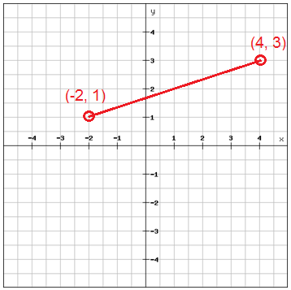

# ***Object***
--------------------------------------
> ### 1. Profile Lookup

We have an array of objects representing different people in our contacts lists.
A `lookUpProfile` function that takes `name` and a property ( `prop` ) as arguments has been pre-written for you.
The function should check if `name` is an actual contact's `firstName` and the given property ( `prop` ) is a property of that contact.
If both are true, then return the `value` of that property.
If `name` does not correspond to any contacts then return `"No such contact"` .
If prop does not correspond to any valid properties of a contact found to match name then return `No such property` .

``` js
// Setup
var contacts = [{
        "firstName": "Akira",
        "lastName": "Laine",
        "number": "0543236543",
        "likes": ["Pizza", "Coding", "Brownie Points"]
    },
    {
        "firstName": "Harry",
        "lastName": "Potter",
        "number": "0994372684",
        "likes": ["Hogwarts", "Magic", "Hagrid"]
    },
    {
        "firstName": "Sherlock",
        "lastName": "Holmes",
        "number": "0487345643",
        "likes": ["Intriguing Cases", "Violin"]
    },
    {
        "firstName": "Kristian",
        "lastName": "Vos",
        "number": "unknown",
        "likes": ["JavaScript", "Gaming", "Foxes"]
    }
];

function lookUpProfile(name, prop) {
    // Only change code below this line

    // Only change code above this line
}

lookUpProfile("Akira", "likes");
```

> ### 2. Pocket Monster Lover 2 

``` javascript
var pokemon = {
    name: "Pikachu",
    stats: {
        hp: 100,
        level: 50,
        attack: 86,
        spattack: 150,
        speed: 5000000000,
        belongTo: "Red"
    },
}
var pikachuSkill = ["Bite", "Thunder Bolt", "Volt Tackle", "Thunderrrr!"]
```

* Speed is wrong, fix it (reduce to 60)
* Pikachu has no skill, he can't handle a battle. Help him by add `pikachuSkill` to Pikachu as `skill` property
* Delete `belongto` property


> ### 3. Gaming


* Add `pocket` - an array `"seashell", "strange berry", và "lint".` 

* delete `dagger` in `backpack` .

* add 50 gold

* delete all infomation about pouch.

> ### 4. Get Sum of People's Budget
Create the function that takes an array with objects and returns the sum of people's budgets.

```js
getBudgets([
  { name: "John", age: 21, budget: 23000 },
  { name: "Steve",  age: 32, budget: 40000 },
  { name: "Martin",  age: 16, budget: 2700 }
]) ➞ 65700

getBudgets([
  { name: "John",  age: 21, budget: 29000 },
  { name: "Steve",  age: 32, budget: 32000 },
  { name: "Martin",  age: 16, budget: 1600 }
]) ➞ 62600
```


> ### 5. Distance Between Two Points
In this challenge, you have to find the distance between two points placed on a Cartesian plane. Knowing the coordinates of both the points, you have to apply the Pythagorean theorem to find the distance between them.



Given two object literals a and b being the two points coordinates (x and y), implement a function that returns the distance between the points, rounded to the nearest thousandth.

```js
getDistance({x: -2, y: 1}, {x: 4, y: 3}) ➞ 6.325

getDistance({x: 0, y: 0}, {x: 1, y: 1}) ➞ 1.414

getDistance({x: 10, y: -5}, {x: 8, y: 16}) ➞ 21.095

```

Notes      
The "distance" is the shortest distance between the two points, or the straight line generated from a to b.

> ### 6. Printer Levels
Given an object of how many more pages each ink color can print, output the maximum number of pages the printer can print before any of the colors run out.

```js
inkLevels({
  "cyan": 23,
  "magenta": 12,
  "yellow": 10
}) ➞ 10

inkLevels({
  "cyan": 432,
  "magenta": 543,
  "yellow": 777
}) ➞ 432

inkLevels({
  "cyan": 700,
  "magenta": 700,
  "yellow": 0
}) ➞ 0
```

Notes   

A single printed page requires each color once, so printing is not possible if any of the slots lack ink (see example #3).

> ### 7. International Greetings
Suppose you have a guest list of students and the country they are from, stored as key-value pairs in an object.
```js
const GUEST_LIST = {
  Randy: "Germany",
  Karla: "France",
  Wendy: "Japan",
  Norman: "England",
  Sam: "Argentina"
}
```
Write a function that takes in a name and returns a name tag, that should read:

"Hi! I'm [name], and I'm from [country]."
If the name is not in the object, return:

"Hi! I'm a guest."
```js

greeting("Randy") ➞ "Hi! I'm Randy, and I'm from Germany."

greeting("Sam") ➞ "Hi! I'm Sam, and I'm from Argentina."

greeting("Monti") ➞ "Hi! I'm a guest."
```

> ### 8. Return the Objects Keys and Values
Create a function that takes an object and returns the keys and values as separate arrays.

```js
keysAndValues({ a: 1, b: 2, c: 3 })
➞ [["a", "b", "c"], [1, 2, 3]]

keysAndValues({ a: "Apple", b: "Microsoft", c: "Google" })
➞ [["a", "b", "c"], ["Apple", "Microsoft", "Google"]]

keysAndValues({ key1: true, key2: false, key3: undefined })
➞ [["key1", "key2", "key3"], [true, false, undefined]]

```

> ### 9. Online Shopping
Create a function that determines whether a shopping order is eligible for free shipping. An order is eligible for free shipping if the total cost of items purchased exceeds $50.00.

```js
freeShipping({ "Shampoo": 5.99, "Rubber Ducks": 15.99 }) ➞ false

freeShipping({ "Flatscreen TV": 399.99 }) ➞ true

freeShipping({ "Monopoly": 11.99, "Secret Hitler": 35.99, "Bananagrams": 13.99 }) ➞ true

```

> ### 10. Paint the Walls
Given a predetermined rate from an object, write the function that will return the time it takes for a certain amount of people to paint a certain amount of walls. Return the minutes as an integer. No rounding is necessary.


```js
// It takes 63 minutes for 4 people to paint 9 walls. -> 4 people take 7 mins for a wall
// one wall take 28 person minutes to complete( one by one) -> 28*4/7 
// How many minutes does it take 14 people to paint 14 walls?
const rate = {
	people: 4,
	 walls: 9,
	 minutes: 63 
}

// time(rate,people,walls) ➞ 22
time(rate,7,4) ➞ 22
```

