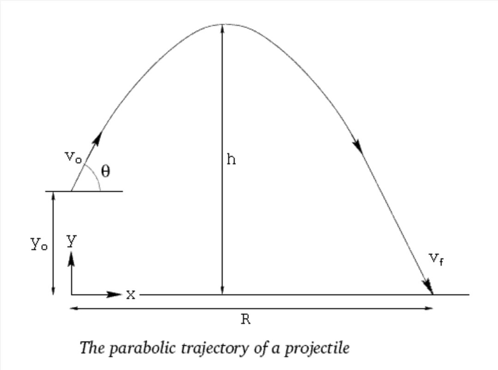

# ***Problems Solving***
_____________________________
> ### 0. Poker Hand Ranking
In this challenge, you have to establish which kind of Poker combination is present in a deck of five cards. Every card is a string containing the card value (with the upper-case initial for face-cards) and the lower-case initial for suits, as in the examples below:

"Ah" ➞ Ace of hearts  
"Ks" ➞ King of spades  
"3d" ➞ Three of diamonds  
"Qc" ➞ Queen of clubs  


There are 10 different combinations. Here's the list, in order of importance:

|Name	            |Description                                        |
|-------------------|---------------------------------------------------|
|Royal Flush        |	A, K, Q, J, 10, all with the same suit.         |
|Straight Flush	    |Five cards in sequence, all with the same suit.    |
|Four of a Kind	    |Four cards of the same rank.                       |
|Full House	        |Three of a Kind with a Pair.                       |
|Flush	            |Any five cards of the same suit, not in sequence.  |
|Straight	        |Five cards in a sequence, but not of the same suit.|
|Three of a Kind	|Three cards of the same rank.                      |
|Two Pair	        |Two different Pair.                                |
|Pair	            |Two cards of the same rank.                        |
|High Card	        |No other valid combination.                        |


Given an array hand containing five strings being the cards, implement a function that returns a string with the name of the highest combination obtained, accordingly to the table above.

```js
pokerHandRanking(["10h", "Jh", "Qh", "Ah", "Kh"]) ➞ "Royal Flush"

pokerHandRanking(["3h", "5h", "Qs", "9h", "Ad"]) ➞ "High Card"

pokerHandRanking(["10s", "10c", "8d", "10d", "10h"]) ➞ "Four of a Kind"
```

> ### 2. Who's That Polygon?
Every polygon has an official name. Individual polygons are named according to the number of sides, combining a Greek-derived numerical prefix with the suffix -gon, e.g. pentagon, dodecagon.

Write a function that takes an integer n as argument and returns the official name of a n-sided polygon.

The following prefixes table is used to construct the name of a polygon.

|   |Ones           |Tens               |Hundreds           |
|---|---------------|-------------------|-------------------|
|1  |hena-, hen-	|10	deca-	        |100	hecta-      |
|2	|di-, do-	    |20	icosi-, icosa-	|200	dohecta-    |
|3  |tri-, tria-	|30	triaconta-	    |300	triahecta-  |
|4  |tetra-	        |40	tetraconta-	    |400	tetrahecta- |
|5  |penta-	        |50	pentaconta-	    |500	pentahecta- |
|6  |hexa-	        |60	hexaconta-	    |600	hexahecta-  |
|7  |hepta-         |70	heptaconta-	    |700	heptahecta- |
|8  |octa-	        |80	octaconta-	    |800	octahecta-  |
|9  |ennea-	        |90	enneaconta-	    |900	enneahecta- |

For polygons with 3 through 9 sides, simply add "-gon" to the ones prefixes. For 10 through 99 sides, you return the tens prefix followed by the ones prefix and then by "-gon". For 100 through 999 sides, you start from the hundreds prefix, then add the tens prefix and finally the ones prefix followed by "-gon".

For polygons with more than 999 sides, the following prefixes are used similarly to how "conta-" and "hecta-" are used for tens and hundreds places respectively:

|Place	            |Prefix             |  
|-------------------|-------------------|
|10	                |conta-             |
|100	            |hecta-             |
|1000	            |chilia-            |
|10,000	            |myria-             |
|100,000	        |decamyria-         |
|200,000	        |icosamyria-        |
|300,000	        |triacontamyria-    |
|1,000,000	        |mega-              |
|1,000,000,000	    |giga-              |
|1,000,000,000,000	|tera-              |

And finally, the 10¹⁰⁰-gon is called googolgon and the ∞-gon (with a countable infinite number of sides) is called apeirogon.

```js

polygonName(3) ➞ "triangle"
// exception of: tri-gon

polygonName(4) ➞ "quadrilateral"
// exception of: tetra-gon

polygonName(5) ➞ "pentagon"
// penta-gon

polygonName(7) ➞ "heptagon"
// hepta-gon

polygonName(19) ➞ "enneadecagon"
// ennea-deca-gon

polygonName(36) ➞ "triacontahexagon"
// triaconta-hexa-gon

polygonName(428) ➞ "tetrahectaicosioctagon"
// tetrahecta-icosi-octa-gon

polygonName(12345) ➞ "myriadichiliatriahectatetracontapentagon"
// myria-dichilia-triahecta-tetraconta-penta-gon
```
Hint:  
The triangle, quadrilateral and nonagon are exceptions, although the regular forms trigon, tetragon, and enneagon are sometimes encountered as well.

> ### 3. Happy Numbers & More
A happy number is a number defined by the following process:   

Starting with any positive integer, replace the number by the sum of the squares of its digits, and repeat the process until the number equals 1 (where it will stay), or it loops endlessly in a cycle which does not include 1. Those numbers for which this process ends in 1 are happy numbers.

A prime number is a natural number greater than 1 that is not a product of two smaller natural numbers.

A perfect number is a positive integer that is equal to the sum of its positive divisors, excluding the number itself.

A triangular number counts objects arranged in an equilateral triangle. The nth triangular number is the number of dots in the triangular arrangement with n dots on a side, and is equal to the sum of the n natural numbers from 1 to n.

**Objective**  
Create a function that takes a number as an argument and returns a print showing if the number is happy or not, if the number is prime or not, if the number is perfect or not and if the number is triangular or not.

```js
happy(2) ➞
"2 is an unhappy number.
2 is a prime number.
2 is not a perfect number.
2 is not a triangular number."

happy(7) ➞
"7 is a happy number.
7 is a prime number.
7 is not a perfect number.
7 is not a triangular number."

happy(8128) ➞
"8128 is a happy number.
8128 is not a prime number.
8128 is a perfect number.
8128 is a triangular number."
```

> ### 4. Prince of Persia Turned Around
You're working for Jaffar in the newest game of Prince of Persia. The prince is coming to get the princess and you have to stop him. He's entering the castle on a horse, don't ask me why he's riding a horse... he just is!

You're standing next to the cannon and you have to check if the aim / velocity / height is ok for hitting the prince on his horse.

Your function will get four values / circumstances:

- Velocity
- Angle
- Height
- Distance to the prince

With the formula of Ballistic Trajectory you'll be able to calculate the distance the cannonball is gonna travel for impact. You don't need to apply rounding.

The complete formula is found here: http://www.convertalot.com/ballistic_trajectory_calculator.html

Computations are based on the acceleration of gravity on the earth's surface (9.81 m/s/s), atmospheric drag is neglected. The chance of hitting the prince / his horse is plus or minus 0.5m.

```js

hitPrince(10, 10, 10, 16) ➞ true

hitPrince(20, 45, 0, 45) ➞ false

hitPrince(5, 45, 10, 6) ➞ true
```

Ballistic Trajectory

Notes    
- No actual princes / horses are harmed during the making of this challenge.
- All the inputs are correct. 0 > Angle < 90, and so on.
Values will be in meters per second / degrees / meters.
I just stole the formula from the js source code of the resource.


> ### 5. Vampire Numbers

A Vampire Number is a positive integer greater than 99, that rearranged in all of its possible digits permutations, with every permutation being split into two parts, is equal to the product of at least one of its permutations.

If the number has an even quantity of digits, left and right parts will have the same length in every permutation;

If the number has an odd quantity of digits and at least three digits, the left and right parts will present different lengths for every possible permutation, alternating between them in the range +1 and -1.
Given a positive integer n, implement a function that returns the type of n as a string:

- `Normal Number` if n is lower than 100 or if no permutations return a product of their parts equal to n.
- `Pseudovampire` if n it is a Vampire with an odd quantity of digits.
- `True Vampire` if n it is a Vampire with an even quantity of digits.
```js
isVampire(1260) ➞ "True Vampire"
// Has an even number of digits and is greater than 99)
// Permutations:
// 12 * 60 = 720
// 16 * 20 = 320
// 10 * 26 = 260
// 21 * 60 = 1260

isVampire(126) ➞ "Pseudovampire"
// Has an odd number of digits and is greater than 99
// Permutations:
// 12 * 6 = 72
// 1 * 26 = 26
// 21 * 6 = 126

isVampire(67) ➞ "Normal Number"
// Is lower than 100
// Permutations:
// 6 * 7 = 7 * 6 = 42
```

Notes    
Trivially, a number from 1 to 99 is a Normal Number by the definitions: a single-digit number can't be split into two parts, and the product of the permutated two digits of a number will always be lower than the number itself.

> ### 6. Double Dot Product
In this challenge, you'll write a function that calculates the double dot product of a pair of dyadics.

What's a dyadic? And what's the double dot product?

First, let's talk about (Euclidean) vectors.

A vector is a geometric object. Its existence doesn't depend on choice of coordinate system, or indeed on choosing a coordinate system at all!

But coordinate systems are useful, and in particular it's often convenient to represent a vector as a matrix of its Cartesian components, either a single column or a single row. We'll use the notation `[v]` to indicate the column-matrix representation of a vector v (called a column-vector). To indicate its row-matrix representation (called a row-vector), we'll use the transpose and write `[v]ᵀ`.

(We'll work only in three-dimensional space, so each vector has three Cartesian components: x, y, and z.)

If we matrix-multiply a row-vector with a column-vector (in that order), the result is a 1-by-1 matrix whose single element is the dot product of the two vectors:

`a • b = Tr([a]ᵀ[b])`

(where we've used the trace). Note that the dot product is commutative (i.e.,` a • b = b • a`).

If we matrix-multiply in the opposite order (column-vector first), the result is a 3-by-3, the matrix representation of a geometric object called a dyad. To notate the dyad formed by vectors a and b, we'll write ab, and we'll notate its matrix-representation `[ab]`. So:

`[ab] = [a][b]ᵀ`.

Note that unlike the dot product, the dyadic product is not commutative, and in fact `[ab] = [ba]ᵀ`.

Now we can talk about dyadics. Dyadics are dyads and sums of dyads. Every dyadic can be represented as a square-matrix of its 9 components. For example:

`[ab + cd] = [ab] + [cd] = [a][b]ᵀ + [c][d]ᵀ`.

The double dot product of a pair of dyadics is an operation that outputs a scalar (a number). For a pair of dyads, it's defined like this:

`(ab):(cd) = (a • c)(b • d)`.

This definition can be extended to arbitrary dyadics by putting the dyadics in sum-of-dyads form and distributing:

`(ab + cd):(ef + gh) = (ab):(ef) + (ab):(gh) + (cd):(ef) + (cd):(gh)`.

Your task is to write a function that takes as parameters the 3-by-3 matrix-representations of a pair of dyadics (each will be a two-dimensional array with numbers for elements) and returns their double dot product (as a number).

The hard part here isn't the coding so much as it is coming up with a matrix-representation of the double dot product that works for arbitrary dyadics. (You might be able to arrive at the answer by trial and error, but try to work it out mathematically!) If you're stuck, see the Comments for a hint.

```js
doubleDot(
  [
    [265, -385, -115],
    [-741, -148, 916],
    [235, -410, 433]
  ],
  [
    [440, -359, 453],
    [-453, -254, 169],
    [-314, 403, -331]
  ]
) ➞ 348446

doubleDot(
  [
    [709, -422, 612],
    [761, 495, 852],
    [-473, 614, 443]
  ],
  [
    [-305, 345, 858],
    [931, -747, -422],
    [855, -156, 109]
  ]
) ➞ -309469

doubleDot(
  [
    [-545, -641, -533],
    [130, 871, 699],
    [712, -375, 164]
  ],
  [
    [157, -647, -631],
    [381, -956, -223],
    [878, -589, -155]
  ]
) ➞ 547053

```

Notes
- There's a second species of double dot product, which for dyads is defined like this:

- `(ab) • • (cd) = (a • d)(b • c)`

- Dyadics aren't used very often these days. In the more powerful framework of tensor analysis, dyadics are contravariant rank-2 tensors, the dyadic product is a special case of the tensor product, and both species of double dot product are tensor contractions (as is the normal dot product between vectors, by the way).


> ### 7. Sentence Primeness
A word value can be established summing up all the numeric values of every single character (excluding spaces and punctuation): a value from 1 ("a") to 26 ("z") is given to letters, while numbers have their literal values, from 0 to 9. The sentence value is the sum of the values of the words.
```js
sentence = "ABC ! abc ... @ 123"
// Remove spaces, punctuation and any symbol.

sentence = ["ABC", "abc", "123"]

words values = "ABC" = 1+2+3 = 6 | "abc" = 1+2+3 = 6 | "123" = 1+2+3 = 6

sentence value = 6 + 6 + 6 = 18
```
Given a string sentence implement a function that returns:

Prime Sentence if the original sentence value is a prime.

Almost Prime Sentence (xxx) if the sentence value is not a prime but, after a single removal of any of the words the new sentence value is a prime (see example #2 for a clearer explanation), with xxx being the word removed. If more than a word can be removed to obtain a prime value, return the first encountered in the original sentence.

Composite Sentence if the sentence value is not a prime and more than one removal is necessary to make the new sentence value (or if none is possible).

Letters values are case `insensitive` ("aZ" = "Az" = 1 + 26 = 27), while numbers are treated as words ("123" = 1+2+3 = 6).

```js

sentencePrimeness("Help me!") ➞ "Prime Sentence"
// "Help" + "me" = 41 + 18 = 59 (prime)

sentencePrimeness("42 is THE aNsWeR...") ➞ "Almost Prime Sentence (aNsWeR)"
// "42" + "is" + "THE" + "aNsWeR" = 6 + 28 + 33 + 80 = 147 (not prime)
// Without "42" new value is 141
// Without "is" new value is 119
// Without "THE" new value is 114
// Without "aNsWeR" new value is 67 (prime!)
// If the word "aNsWeR" is removed from sentence the new value is a prime.

sentencePrimeness("Did you smoke?") ➞ "Composite Sentence"
// "Did" + "you" + "smoke" = 17 + 61 + 63 = 141 (not prime)
// Without "Did" new value is 124
// Without "you" new value is 80
// Without "smoke" new value is 78
// No single removals make the new sentence value a prime.
```
Notes    

- Only letters and digits can be part of the sentence.

- If it's an Almost Prime Sentence, the removed word between the brackets must maintain the same capitalization format found in the original sentence (see example #2).

- The sentence is Almost Prime if just a single word can be removed to make value a prime, no multiple removals allowed.
Remember the rule for numbers: "10" is a word, so its value is 1+0 and not 10.


> ### 8. The Mysterious Number 6174
The number 6174 is a really mysterious number. At first glance, it might not seem so obvious. But as we are about to see, anyone who can subtract can uncover the mystery that makes 6174 so special.

In 1949 the mathematician D. R. Kaprekar devised a process now known as Kaprekar's operation. First choose a four digit number where the digits are **not all the same**(that is not 1111, 2222, and so on). Then rearrange the digits to get the largest and smallest numbers these digits can make. Finally, subtract the smallest number from the largest to get a new number, and carry on repeating the operation for each new number.

It is a simple operation, but Kaprekar discovered it led to a surprising result: When we reach 6174 the operation repeats itself, returning 6174 every time. In fact, you reach 6174 for all four digit numbers that don't have all the digits the same. It's marvellous. Kaprekar's operation is so simple but uncovers such an interesting result.

**Objective**
Create a function that takes a `four digit` number as an argument and returns the numbers of `iterations` needed to reach the number 6174, as well as a print of each iteration. If the number is a repdigit, the function must return a message to the user.

**Important**
If in any iteration you have a 1-digit, 2-digits or 3-digits number, add `leading zeros` for the calculations and the prints. Please see example below where n = 1.
Based on the point mentioned before, you can expect, for example, that the numbers 1 and 1000 will lead to the same iterations.
```js


Kaprekar(1234) ➞ 3
// "---------- The Mysterious Number 6174 ----------"
// Number of iterations: 3
// Iterations:

// Iteration Nr. 1: 4321 - 1234 = 3087
// Iteration Nr. 2: 8730 - 0378 = 8352
// Iteration Nr. 3: 8532 - 2358 = 6174
// "------------------------------------------------"


Kaprekar(2005) ➞ 7
// "---------- The Mysterious Number 6174 ----------"
// Number of iterations: 7
// Iterations:

// Iteration Nr. 1: 5200 - 0025 = 5175
// Iteration Nr. 2: 7551 - 1557 = 5994
// Iteration Nr. 3: 9954 - 4599 = 5355
// Iteration Nr. 4: 5553 - 3555 = 1998
// Iteration Nr. 5: 9981 - 1899 = 8082
// Iteration Nr. 6: 8820 - 0288 = 8532
// Iteration Nr. 7: 8532 - 2358 = 6174

// "------------------------------------------------"


Kaprekar(8888) ➞ NaN 
// "---------- The Mysterious Number 6174 ----------"
// 
// Error, n cannot be a repdigit.

// "------------------------------------------------"


Kaprekar(1) ➞ 5
// "---------- The Mysterious Number 6174 ----------

// Number of iterations: 5
// Iterations:

// Iteration Nr. 1: 1000 - 0001 = 0999
// Iteration Nr. 2: 9990 - 0999 = 8991
// Iteration Nr. 3: 9981 - 1899 = 8082
// Iteration Nr. 4: 8820 - 0288 = 8532
// Iteration Nr. 5: 8532 - 2358 = 6174

// "------------------------------------------------"
```

> ### 9. Persistence
The additive persistence of an integer, n, is the number of times you have to replace n with the sum of its digits until n becomes a single digit integer.

The multiplicative persistence of an integer, n, is the number of times you have to replace n with the product of its digits until n becomes a single digit integer.

Create two functions that take an integer as an argument and:

Return its `additive persistence`.
Return its `multiplicative persistence`.
```js
//Additive Persistence
additivePersistence(1679583) ➞ 3
// 1 + 6 + 7 + 9 + 5 + 8 + 3 = 39
// 3 + 9 = 12
// 1 + 2 = 3
// It takes 3 iterations to reach a single-digit number.

additivePersistence(123456) ➞ 2
// 1 + 2 + 3 + 4 + 5 + 6 = 21
// 2 + 1 = 3

additivePersistence(6) ➞ 0
// Because 6 is already a single-digit integer.
```
```js
//Multiplicative Persistence
multiplicativePersistence(77) ➞ 4
// 7 x 7 = 49
// 4 x 9 = 36
// 3 x 6 = 18
// 1 x 8 = 8
// It takes 4 iterations to reach a single-digit number.

multiplicativePersistence(123456) ➞ 2
// 1 x 2 x 3 x 4 x 5 x 6 = 720
// 7 x 2 x 0 = 0

multiplicativePersistence(4) ➞ 0
// Because 4 is already a single-digit integer.
```

> ### 10. Guitar Tuner
Create a function that takes guitar strings as an array of frequencies (numbers) and returns the display of a tuner as an array. You can find the frequencies of the strings on the Wikipedia page (check the Resources tab).

The guitar strings are played 1st to 6th, High E to Low E.

If the guitar string matches, return `"OK"` for that guitar string.

If it's too low, return `">•"` for 1 or 2 percent off (the arrow means, tune up).

Return `">>•"` if it's way off. For more than 3 percent.
If it's too high, return `"•<"` for 1 or 2 percent, and `"•<<"` for more, (tune down).

Check the rounded percentages.
If 0 is given, the guitar string isn't played, return " - ".
```js
tune([0, 246.94, 0, 0, 0, 80]) ➞ [" - ", "OK", " - ", " - ", " - ", ">>•"]

tune([329, 246, 195, 146, 111, 82]) ➞ ["OK", "OK", ">•", ">•", "•<", "OK" ]

tune([329.63, 246.94, 196, 146.83, 110, 82.41]) ➞ ["OK", "OK", "OK", "OK", "OK", "OK"]
```

Notes  
Items in the array will always be numbers.
