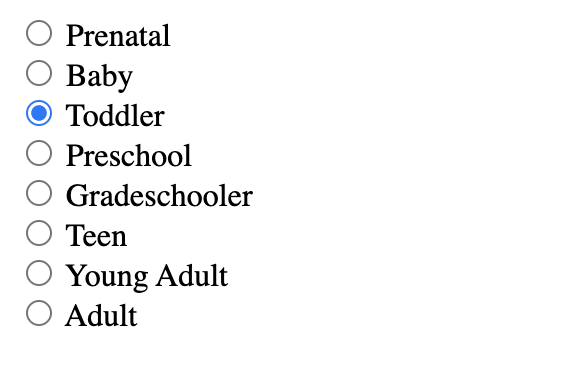
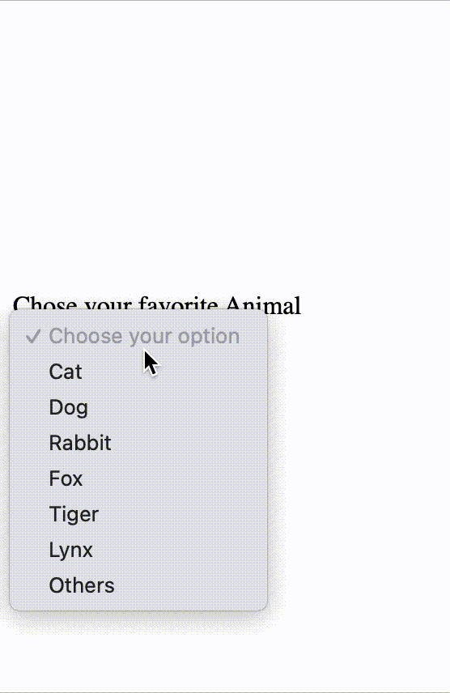
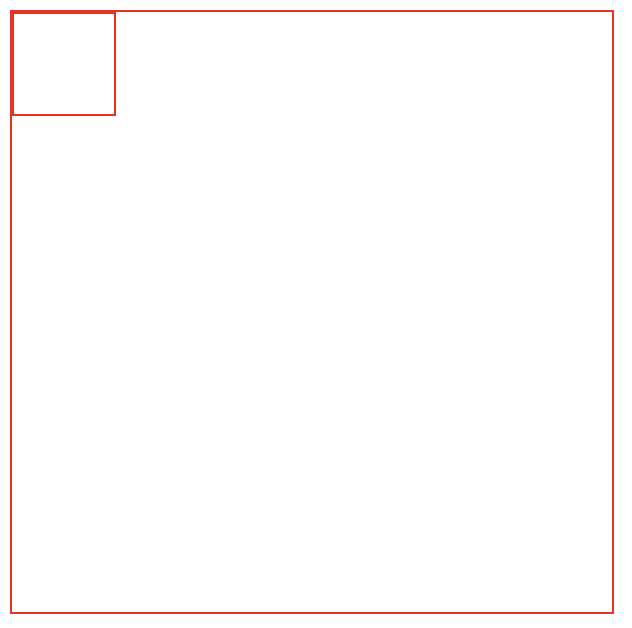

# Entrance exam for mentor

## JSB
### Kiến thức về HTML
1. HTML 2 loại tag chủ yếu là inline & block. Hãy phân loại các tag sau và nêu sự khác biệt của loại tag inline & block.
```html
<div>
<span>
<p>
<ol>
<label>
<input>
<h1>
<b>
<video>
<br>
<hr>

```
<details>
<summary>Đáp án</summary>

Các inline element là `<span> <label> <input> <b> <br> ` và các block element là `<div> <p> <ol> <h1> <video> <hr>`
Đa số inline element không thể xác định kích thước (width & height), vì kích thước tuỳ thuộc vào nội dung bên trong, hiển thị trên cùng một hàng. Block element mặc định sẽ chiếm toàn bộ chiều dài (của element cha  - nếu có). Khi đặt thuộc tính width & height thì chiều dài vẫn không thay đổi vì được bù qua phần margin

</details>

---

2. viết code html để liên kết file js & css từ page.html & index.html cấu trúc thư mục sau.
Cây thư mục của các file hiện tại   
```txt
project
├── assets
│   ├── css
│   │   ├── index.css
│   │   └── page.css
│   ├── js
│   │   ├── index.js
│   │   └── page.js
│   └── page.html
└── html
    └── index.html
```

<details>
<summary>Đáp án</summary>

```html
<link rel="stylesheet" href="./css/page.css">
<script src="./js/page.js"></script>
<link rel="stylesheet" href="/assets/css/index.css">
<script src="/assets/js/index.js"></script>
```
hoặc các cách viết path khác mang lại kết quả tương tự

</details>

---

3. Tác dụng của thẻ br & hr

<details>
<summary>Đáp án</summary>

`<br>` giúp xuống hàng ngay lập tức, `<hr>` xuống hàng ngay lập tức và kẻ một đường ngang 

</details>

---

4. Viết một hyperlink dẫn tới google, khi click vào tự mở sang tab mới.

<details>
<summary>Đáp án</summary>

```html 
<a href="https://google.com" targe="_blank">
```

</details>

---

5. Hãy nêu sự khác biệt giữa `<textarea>` & `<input>` elements

<details>
<summary>Đáp án</summary>

Tag `input` có thể có nhiều loại (range, color, ...) tuỳ thuộc vào attribute `type`. textarea thường dùng để nhập một số lượng văn bản lớn, có thể tuỳ chỉnh font chữ, resize,..

</details>

---

6. Cấu trúc cơ bản của `<table>` gồm những gì? Làm thế nào để tạo một table có đủ các thành phần sử dụng các element liên quan.

<details>
<summary>Đáp án</summary>

Gồm table head và table body (foot là optional). Sử dụng tag `<thead>` để tạo headings (tên các cột) kết hợp với `<th>`. `<tbody>` kết hợp với `<tr>` (table row) & `<td>` (table data cell)

</details>

---

7. Hãy nêu điểm giống và khác nhau cơ bản giữa ul & ol & dl

<details>
<summary>Đáp án</summary>

Cả 3 đều có một mục đích chung là biểu diễn một danh sách nhiều nội dung khi kết hợp với `li`. Điểm khác nhau cơ bản là `ul` sử dụng dấu chấm tròn (có thể tuỳ chỉnh dấu khác) để phân tách nội dung. `ol` sử dụng số (thập phân, la mã). `dl` sử dụng indetation (thụt lề)

</details>

---

8. Làm một radio set như hình


<details>
<summary>Đáp án</summary>
```html
<form>
    <input type="radio" name="age" value="Prenatal"> <label>Prenatal</label> <br/>
    <input type="radio" name="age" value="Baby"> <label>Baby</label><br/>
    <input type="radio" name="age" value="Toddler"> <label>Toddler</label><br/>
    <input type="radio" name="age" value="Preschool"> <label>Preschool</label><br/>
    <input type="radio" name="age" value="Gradeschooler"> <label>Gradeschooler</label><br/>
    <input type="radio" name="age" value="Teen"> <label>Teen</label><br/>
    <input type="radio" name="age" value="Young Adult"> <label>Young Adult</label><br/>
    <input type="radio" name="age" value="Adult"> <label>Adult</label><br/>
</form>
```

</details>

---

9. Làm một combobox như hình



<details>
<summary>Đáp án</summary>

```html
<form>
    <label>Chose your favorite Animal</label> <br>
    <select>
        <option value="null" selected disabled>Choose your option</option>
        <option value="cat">Cat</option>
        <option value="dog">Dog</option>
        <option value="rabbit">Rabbit</option>
        <option value="fox">Fox</option>
        <option value="tiger">Tiger</option>
        <option value="lynx">Lynx</option>
        <option value="others">Others</option>
    </select>
</form>
```

</details>

---

### Kiến thức về CSS 

1. Liệt kê các loại CSS selector cơ bản (4 loại)

<details>
<summary>Đáp án</summary>

Universal (*), class(.), id (#), element([elementName]- p,h1,eg.)

</details>

---

2. Liệt kê 5 CSS pseudo class/element

<details>
<summary>Đáp án</summary>

:hover, :focus, :visited, :disabled, :first-child, :last-child,... Hoặc những thứ tương tự.

</details>

---

3. Hãy nêu sự khác nhau của hệ màu RGBA so với RGB

<details>
<summary>Đáp án</summary>
Có thêm thuộc tính alpha để tuỳ chỉnh transparent (độ trong suốt)

</details>

---

4. justify-content và align-items (flexbox) căn chỉnh theo các chiều nào? Giải thích.

<details>
<summary>Đáp án</summary>

Căn chỉnh theo main/cross axis tuỳ thuộc vào direction của container flexbox

</details>

---

5. `box-sizing:border-box` là gì? Giải thích về việc đặt kích thước đối với `content-box` & `border-box`.

<details>
<summary>Đáp án</summary>

Khiến element biến bản thân thành border-box thay vì content-box. 
Khi xác định kích thước cho element `border-box` thì kích thước thực tế chính là kích thước đã được xác định (content + padding + border). Đối với `content-box` thì kích thước đã xác định chỉ là phần kích thước của content, vậy nên kích thước thực tế sẽ dư thêm border & padding

</details>

---

6. Sử dụng thuộc tính CSS phù hợp khiến một hình ảnh (vuông) trở thành hình tròn.

```html
<div class="rounded">
</div>
```

```css
div{
    width: 500px;
    height: 500px;
    background-color:yellow;
}
```

<details>
<summary>Đáp án</summary>

```css
 .rounded{
    border-radius: 50%;
    clip-path: circle(50%);
}
```

</details>

---

7. Tạo một button có hình pill như sau

```html
<div class="pill">
</div>
```
```css
div{
    width: 500px;
    height: 500px;
    background-color:yellow;
}
```

<details>
<summary>Đáp án</summary>

```css
.pill{
    border-radius: 999px;
}
```

</details>

---

8. Viết file css để căn giữa element div trong trường hợp sau



```html
<div class="container border">
    <div class="square border"></div>
</div>
```

```css
.border{
    border:1px solid red;
}
.container{
    width: 300px;
    height: 300px;
}
.square{
    width: 50px;
    height: 50px;
}
```

<details>
<summary>Đáp án</summary>

```css

.container{
    position: relative;
    top: 0;
    left: 0;
}
.square{
    position: absolute;
    left:50%;
    top: 50%;
    transform: translate(-50%,-50%);
}
```

</details>

---

9. Viết các selector phù hợp để được kết quả như hình 

```html
 <div>
        <p>Blue</p>
        <p>Orange</p>
        <span>
            <p>Purple</p>
        </span>
    </div>
    <p>Orange</p>

    <span>
        <p>Black</p>
    </span>
    <p>Aqua</p>
```

Viết CSS Selector để cho màu chữ của thẻ p có cùng màu với nội dung bên trong

<details>
<summary>Đáp án</summary>

```css
div > p:nth-child(1){
            color: blue;
        }
        div > p:nth-child(2){
            color: orange;
        }
        span > p {
            color: black;
        }
        div > span > p{
            color: purple;
        }
        span ~ p{
            color: aqua;
        }
        div + p{
            color: orange;
        }

```

</details>

---

10. Chỉ sử dụng CSS, hãy di chuyển vị trí các ô trở nên sang như hình mẫu với cấu trúc HTML/CSS cho sẵn


```html
<div class="container border">
    <div class="rectangle red"></div>
    <div class="square green"></div>
    <div class="square green"></div>
    <div class="square yellow"></div>
    <div class="square yellow"></div>
    <div class="rectangle blue"></div>
</div>
```

```css
.red{
    background-color: red;
}
.yellow{
    background-color: yellow;
}
.green{
    background-color: green;
}
.blue{
    background-color: blue;
}
.container {
    position: relative;
    left: 0;
    top: 0;
    width: 600px;
    height: 600px;
}
.square{
    width: 200px;
    height: 200px;
}
.rectangle{
    width: 300px;
    height: 100px;
}
```

<details>
<summary>Đáp án</summary>

```css
.container > div:nth-child(2){
    position: absolute;
    left: 300;
    top: 0;
}
.container > div:nth-child(3){
    position: relative;
    top: 100;
    left: 0;
}
    .container > div:nth-child(4){
    position: relative;
    top: 100;
}
.container > div:nth-child(5){
    position: absolute;
    top: 200;
    left: 300;
}
.container > div:nth-child(6){
    position: absolute;
    left: 300;
} 

```

</details>

---

### Kiến thức về Javascript

1. Trả lời kết quả được in ra màn hình ở console của đoạn code sau? Giải thích dòng thứ 4. Làm sao để kiểm tra giá trị một biến có kiểu dữ liệu là Array

```js
let a = {};
let b = "";
let c = 0;
let d = [];
console.log(typeof a)
console.log(typeof b)
console.log(typeof c)
console.log(typeof d)
```

<details>
<summary>Đáp án</summary>

```
object
string
number
object
```

Giải thích. Array kế thừa từ object nên về cơ bản array cũng là object. typeof chỉ kiểm tra các kiểu dữ liệu nguyên thuỷ (primitives) (và một số khác). Còn lại thì sẽ trả về object (kể cả instance của một class nếu sử dụng typeof).
Sử dụng static method `Array.isArray()` 

</details>

---

2. Đoạn code sau in ra màn hình kết quả gì? Giải thích.
```js
let a = {
    b:{
        name:'Son',
        role:'ta'
    },
    c:{
        name:'Quang',
        role:'mentor'
    }
}
let b = a.b;
let c = a.c;
delete a
delete a.b
delete a.c
console.log(a)
console.log(b)
console.log(c)
```

<details>
<summary>Đáp án</summary>

```js
{}
{name: "Son", role: "ta"}
{name: "Quang", role: "mentor"}
```

Object là reference type nên khi khai báo, ta thực chất đang tạo một reference tới một vùng nhớ lưu giá trị. Điều này cũng đúng đối với việc khai báo key của property, nếu value là một obect thì sẽ cũng tạo reference. Sử dụng `delete` chỉ xoá reference tới ô nhớ đó chứ không phải giải phóng vùng nhớ. Khi gán b,c thực chất chúng ta đã lưu reference tới của object và lưu vào biến b,c.

</details>

---

3. Có bao nhiêu cách viết vòng lặp for? Nêu cấu trúc phù hợp với các loại vòng lặp?

<details>
<summary>Đáp án</summary>

Có 3 loại vòng lặp for: vòng lặp `for` cổ điển gồm 3 thành phần lặp n lần, vòng lặp `for in` và vòng lặp `for of`
```js
for(let i =0 ;i<5;i++){
    console.log(i)
}
let array = [1,2,3,4]
for (let element of array){
    console.log(element)
}
let obj = {
    name:'Mindx',
    company:'Illiat'
}
for(let key in obj){
    console.log(obj[key])
}
```

</details>

---

4. Sự khác nhau giữa break & continue

<details>
<summary>Đáp án</summary>

`break` kết thúc vòng lặp gần nhất, continue kết thúc lần lặp hiện tại, bắt đầu lần lặp mới. 

</details>

---

5. khác sự khác nhau giữa sự kiện input & change của text?

<details>
<summary>Đáp án</summary>

</details>

---

6. Kết quả của đoạn code là gì? Giải thích
```js
function f (){
        let b = 9
        return ++b < 10 ? b : 'Yah'
    }
    let a = f()
    console.log(a)
```

<details>
<summary>Đáp án</summary>

```js
Yah
```
Lí do bởi vì toán tử ++ là toán tử tăng, và được đặt bên trái (pre-increment) nên biến b được tăng lên 1 (10). Khi so sánh bé hơn thì kết quả là false nên kết quả là 'Yah'

</details>

---

7. Đề xuất giải pháp thay thế cấu trúc if else sau đây để khiến code trở nên gọn gàng.
Chữ La Mã hàng đơn vị. Sửa đổi hàm `roman_unit`

```js
function roman_unit(decimal_number) {
        let decimal = parseInt(decimal_number)
        let roman_number = ""
        if (decimal_number == 1) {
            roman_number = "I"

        } else if (decimal_number == 2) {
            roman_number = "II"

        } else if (decimal_number == 3) {
            roman_number = "III"

        } else if (decimal_number == 4) {
            roman_number = "IV"

        } else if (decimal_number == 5) {
            roman_number = "V"

        } else if (decimal_number == 6) {
            roman_number = "VI"

        } else if (decimal_number == 7) {
            roman_number = "VII"

        } else if (decimal_number == 8) {
            roman_number = "VIII"

        } else if (decimal_number == 9) {
            roman_number = "IX"

        } else if (decimal_number == 10) {
            roman_number = "X"

        } else {
            roman_number = "?"
        }
        return roman_number
    }
    let result = roman_unit(9)
```

<details>
<summary>Đáp án</summary>

Sử dụng switch case hoặc object để chuyển đổi

</details>

---

8. Giải thích phương thức `element.insertAdjacentHTML()`. Viết một hàm 10 nút tương ứng, đi kèm với eventListener là in ra màn hình giá trị của nút đó (được cung cấp trong mảng) và chèn vào trong element có id là `container`.
```js
let animals = ['cat','rabbit','dog','fox','fish','racoon','tiger','bear','parrot','snake']
```

<details>
<summary>Đáp án</summary>

```js
let animals = ['cat','rabbit','dog','fox','fish','racoon','tiger','bear','parrot','snake']
function createButton(inner){
    return `
    <button>${inner}</button>
    `
}
let cont = document.getElementById("container")
cont.insertAdjacentHTML("beforeend",animals.map(createButton).join(""))
let btns = document.querySelectorAll("button")
btns.forEach(btn => {
    btn.addEventListener("click",(e)=>{
        console.log(e.target.innerHTML)
    })
})
```
<details>

---

9. Chỉnh sửa đoạn code sau trở lại cho chính xác. Giải thích 

```js
function bmi_calculator(weight_in_kg, height_in_cm) {
    let bmi = weight_in_kg / height_in_cm /height_in_cm * 10000  ;
    bmi = parseFloat(bmi.toFixed(2))
    let status = ""
    switch (true) {
        case 0 < bmi < 18.5:
            status = "Underweight"
            break
        case 18.5 < bmi < 25:
            status = "Normal"

            break
        case 25 < bmi < 30:
            status = "Overweight"

            break
        case bmi < 30:
            status = "Obese"

            break
        default:
            status = '?'
    }
    return {
        bmi:bmi,
        status:status
    }

}
let result = bmi_calculator(65, 170)
console.log(result)
// {bmi: 22.49, status: "Underweight"}
```

<details>
<summary>Đáp án</summary>

<details>

---

10. một element có thể có tối đa bao nhiêu listener cho 1 event cố định. Làm sao xoá listener (unsubscribe) khỏi 1 event? Cho ví dụ cụ thể.

<details>
<summary>Đáp án</summary>

Một element có thể có nhiều listener cho 1 event cố định. Thứ tự invoke lần lượt đúng như thứ tự khi subscribe event đó. Lưu ý rằng nếu các listener là async thì vẫn tuân theo quy tắc xử lý bất đồng bộ. 
Để xoá một eventListener cần phải lưu trữ lại reference tới function, và sử dụng hàm `removeEventListener`

```js
 let btn = document.getElementById("btn")
    let a = async () => {
        console.log("first")
    }
    btn.addEventListener("click", a)
    
    btn.addEventListener("click",()=>{
        btn.removeEventListener("click",a)
        console.log("second")
    })
```

</details>

---

## JSA

### Kiến thức git & github
1. Tạo một repository ở local machine (máy tính cá nhân) và lưu trữ source code lên remote repository ở github

2. Tạo một commit. Quay lui HEAD về commit trước đó.
3. Thêm/xoá branch. Merge branchs. Giải quyết conflict
4. Giải thích các lệnh cơ bản của git 

### Kiến thức về Javascript 

1. Cho đoạn code như sau. Kết quả khi tương tác với form là gì? Giải thích tại sao lại như vậy?. Đề xuất ít nhất 2 cách giải quyết trường hợp trên.
```html
<p id="help">Helpful notes will appear here</p>
<p>E-mail: <input type="text" id="email" name="email"></p>
<p>Name: <input type="text" id="name" name="name"></p>
<p>Age: <input type="text" id="age" name="age"></p>
```
```js
function showHelp(help) {
  document.getElementById('help').textContent = help;
}

function setupHelp() {
  var helpText = [
      {'id': 'email', 'help': 'Your e-mail address'},
      {'id': 'name', 'help': 'Your full name'},
      {'id': 'age', 'help': 'Your age (you must be over 16)'}
    ];

  for (var i = 0; i < helpText.length; i++) {
    var item = helpText[i];
    document.getElementById(item.id).onfocus = function() {
      showHelp(item.help);
    }
  }
}

setupHelp();
```

2. localStorage là gì? Các kiểu dữ liệu mà localStorage có thể lưu trữ? Làm sao lữu trữ dữ liệu dạng array/object?
`localStorage`  một property read-only của global giúp giúp ta truy cập tới Storage Object của bất kỳ document nhằm mục đích lưu trữ dữ liệu ở client vô thời hạn.`localStorage` lưu trữ dữ liệu `primitives`. Muốn lưu trữ các `Object`/`Array` trong javascript thì phải parse sang dạng `JSON`

3. Implement lại hàm map/reduce/filter method của mảng thành hàm myMap/myReduce/myFilter.
```js
// Ít nhất làm đúng logic cơ bản là thế này
Array.prototype.myMap = function (callback) {
        let t = []
        for (let e of this){
            t.push(callback(e))
        }
        return t
    }
Array.prototype.myFilter = function (callback) {
    let t = []
    for (let e of this){
        if (callback(e)){
            t.push(e)
        }
    }
    return t
}
Array.prototype.myReduce = function (callback,accumulator) {
        let acc = accumulator || 0
        let t = []
        for (let e of this){
            acc = callback(acc,e)     
        }
        return acc
    }
```
4. Event Loops của Javascript là gì? Tại sao Javascript chạy được nhiều tác vụ bất đồng bộ khác nhau cùng 1 lúc (promise)?
[Event Loop](https://www.youtube.com/watch?v=8aGhZQkoFbQ) là một vòng lặp vô tận trong Javascript Runtime dùng để lắng nghe các Event (khi các event được trigger).


5. Viết một regular expression có thể match được email. Ví dụ 
```txt
Letters to the Editor (Your complete mailing address is required):
letters@thehindu.co.in
Readers' Editor:
readerseditor@thehindu.co.in
Advertisements Queries (Print):
inetads@thehindu.co.in
Advertisements Queries (Online):
digital@thehindu.co.in
Advertisements Queries (International):
international@thehindu.co.in
Subscription Queries:
subs@thehindu.co.in
Comments on the website:
web.thehindu@thehindu.co.in
```
```txt
digital@thehindu.co.in;
inetads@thehindu.co.in;
international@thehindu.co.in;
letters@thehindu.co.in;
readerseditor@thehindu.co.in;
subs@thehindu.co.in;
web.thehindu@thehindu.co.in;
```

6. Hãy cho biết kết quả đoạn code sau và giải thích.
```js
function resolveAfter2Seconds() {
  console.log("starting slow promise")
  return new Promise(resolve => {
    setTimeout(function() {
      resolve("slow")
      console.log("slow promise is done")
    }, 2000)
  })
}

function resolveAfter1Second() {
  console.log("starting fast promise")
  return new Promise(resolve => {
    setTimeout(function() {
      resolve("fast")
      console.log("fast promise is done")
    }, 1000)
  })
}

async function sequentialStart() {
  console.log('==SEQUENTIAL START==')

  // 1. Execution gets here almost instantly
  const slow = await resolveAfter2Seconds()
  console.log(slow) // 2. this runs 2 seconds after 1.

  const fast = await resolveAfter1Second()
  console.log(fast) // 3. this runs 3 seconds after 1.
}

async function concurrentStart() {
  console.log('==CONCURRENT START with await==');
  const slow = resolveAfter2Seconds() // starts timer immediately
  const fast = resolveAfter1Second() // starts timer immediately

  // 1. Execution gets here almost instantly
  console.log(await slow) // 2. this runs 2 seconds after 1.
  console.log(await fast) // 3. this runs 2 seconds after 1., immediately after 2., since fast is already resolved
}

function concurrentPromise() {
  console.log('==CONCURRENT START with Promise.all==')
  return Promise.all([resolveAfter2Seconds(), resolveAfter1Second()]).then((messages) => {
    console.log(messages[0]) // slow
    console.log(messages[1]) // fast
  })
}

async function parallel() {
  console.log('==PARALLEL with await Promise.all==')

  // Start 2 "jobs" in parallel and wait for both of them to complete
  await Promise.all([
      (async()=>console.log(await resolveAfter2Seconds()))(),
      (async()=>console.log(await resolveAfter1Second()))()
  ])
}

sequentialStart() // after 2 seconds, logs "slow", then after 1 more second, "fast"

// wait above to finish
setTimeout(concurrentStart, 4000) // after 2 seconds, logs "slow" and then "fast"

// wait again
setTimeout(concurrentPromise, 7000) // same as concurrentStart

// wait again
setTimeout(parallel, 10000) // truly parallel: after 1 second, logs "fast", then after 1 more second, "slow"
```

---

Từ câu tiếp theo trở đi sẽ sử dụng chung source code như sau. Đoạn code trên có thể chọn ngẫu nhiên 10 pokemon.
```js
const domain = 'https://pokeapi.co/api/v2'
const endpoint = 'pokemon'

async function getPokemonNames(pokemonID) {
    const start_time = new Date().valueOf()
    const pokemonName = [];
    for (let i = 0; i < pokemonID.length; i++) {
        pokemonName.push(await getPokemon( `${domain}/${endpoint}/${pokemonID[i]}`))
    }
    return pokemonName
}

function main(){
    const pokemonId = []
    for (let i = 0; i < 10; i++) {
        pokemonId.push(Math.floor(Math.random() * 600))
    }
    console.time('Operation')
    getPokemonNames(pokemonId)
    .then(pokemons => {
        console.log(pokemons)
        console.timeLog("Operation")
    })
}
async function getPokemon(url) {
    // 
}
main()
```

7. Viết hàm `getPokemon` để chương trình chạy đúng, lấy dữ liệu thông endoints bằng `fetch()`, sau đó trả về mảng gồm tên của từng Pokemon. Viết bằng 2 cách (async - await & promise).

```js
function getPokemon(url) {
    return fetch(url)
        .then(response => response.json())
        .then(pokemon => {
            return pokemon.name
        })
}
async function getPokemon(url) {
    const response = await fetch(url)
    const pokemon = await response.json()
    const name = pokemon.name
    return name
}
```

8. Đoạn code ở trên có thời gian thực thi ước tính trên trình duyệt Brave (nhân Chrome) là khoảng 3500ms (Có thể sai số bởi vì tốc độ mạng, server,...). Có cách nào giảm thời gian thực thi xuống không? Nếu có thì hãy trình bày giải pháp và giải thích.

Cập nhật hàm getPokemonNames sử dụng Promise.all. Promise all sẽ bắt đầu tất cả các project tại cùng 1 thời điểm => thời gian hoàn thành bằng thời gian dài nhất của các request. Đoạn code cũ, ta đợi từng request hoàn và tiếp tục gửi request => thời gian hoàn thành bằng tổng thời gian hoàn thành của request

```js
async function getPokemonNames(pokemonID) {
    const start_time = new Date().valueOf()
    const pokes = Promise.all(
        pokemonID.map(id=>{
            return getPokemon(`${domain}/${endpoint}/${id}`)
        })
    )
    return await pokes
}
```

9. Cập nhật hàm ở` main` để có thể kết thúc hàm công việc đang chạy (lấy dữ liệu) nếu thời gian chạy quá chậm  (> 2000ms)
Hàm main có thể dùng được viết lại như sau.
```js
function main(){
    return new Promise((resolve,reject)=>{
        const pokemonId = []
        for (let i = 0; i < 10; i++) {
            pokemonId.push(Math.floor(Math.random() * 600))
        }
        console.time('Operation')
        getPokemonNames(pokemonId)
        .then(pokemons => {
            console.timeLog("Operation")
            resolve(pokemons)
        })
        setTimeout(()=>{
            reject(new Error("Too long"))
        },1000)
    })
    
}
```
## JSI
- DB / NoSQl / Firebase
1. Điểm yếu của noSQL? Firestore? 
2. onSnapshot?
3. querySnapshot?
- Authentication / Authorization / SMS / Email confirm / Firestore
2. Tìm hiểu về việc authentication
- Cloud functions
1. Viết một cloud function cho phép upload ảnh bằng lưu trữ bằng cloud storage. Kết quả trả về là public url của ảnh có thể truy cập ở mọi nơi. Viết bằng html/css/js
- dp. Trình bày ít nhất 3 cách viết hàm tính số fibonacci thứ n.